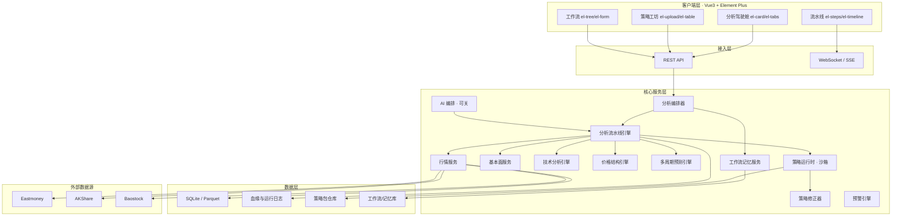
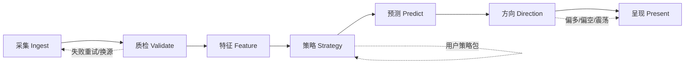
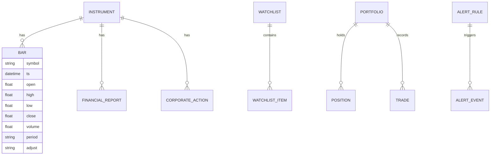

# 本地智能股票分析平台 — 产品需求文档（PRD）

| 项目 | 内容 |
|------|------|
| **文档版本** | v1.2 |
| **产品代号** | Local Stock Analysis（LSA） |
| **文档状态** | 草案 / 评审用 |
| **目标读者** | 产品、研发、测试、运维、合规 |
| **最后更新** | 2026-05-19 |

---

## 1. 文档目的与范围

### 1.1 目的

定义一款**本地优先（Local-First）**、**顶级体验**、**分析流水线可观测**的短/中/长线股票分析平台的产品边界与演进路线，指导从当前 MVP 向**可配置、可记忆、可自我修正的智能分析工作台**演进。

### 1.2 范围

| 在范围内（核心） | 在范围外 |
|------------------|----------|
| **短线 / 中线 / 长线**多维分析、方向研判、价格结构分析 | 实盘下单、券商柜台、真实资金划转 |
| 数据自动化采集 → 计算 → 结论，**全流程可展示「分析方向」** | 持牌投顾、代客理财、保证收益承诺 |
| **用户自主上传分析策略**（脚本/配置），沙箱执行 | 高频/毫秒级交易基础设施 |
| **短/中/长期预测**（概率区间 + 情景，非喊单） | 以「必涨必跌」为卖点的荐股 |
| **策略自主修正**（参数调优、规则修订、人工确认） | 多租户 SaaS 商业化（可预留） |
| **工作流记忆配置**（分析习惯、默认周期、模板复用） | |
| 预警、报告、自选、可选记账（非交易） | |

#### 1.2.1 交易能力边界（必读）

无券商柜台接入 → **不提供任何真实买卖能力**。产品输出均为分析结论与概率研判，用户自行决策。模拟、记账、回测仅用于验证策略与复盘，UI 须标注「非实盘」。

### 1.3 术语

| 术语 | 说明 |
|------|------|
| **标的** | 股票、ETF、指数等可交易证券 |
| **分析方向** | 对后市倾向的结构化表达：偏多/偏空/震荡 + 置信度 + 依据链，非买卖指令 |
| **分析流水线** | 从数据拉取、清洗、特征、策略、预测到展示的 DAG/步骤序列 |
| **策略包** | 用户上传的分析逻辑（Python/YAML/JSON），含版本与修正历史 |
| **预测视界** | 短线（1–5 交易日）、中线（2–12 周）、长线（3–36 月） |
| **工作流记忆** | 持久化的分析偏好：常用指标、默认周期、上次未完成的分析上下文 |
| **策略修正** | 系统或用户根据回测/实盘反馈（记账）调整参数或规则，保留 diff 与审批 |
| **复权** | 前复权（qfq）、后复权（hfq）、不复权 |
| **Local-First** | 数据与计算优先落在用户本机，降低隐私与延迟风险 |

---

## 2. 产品愿景与定位

### 2.1 愿景

> 打造**顶级体验**的本地分析工作台：数据自动流转、分析方向一目了然、策略由你定义并可迭代修正，覆盖短线节奏、中线波段、长线价值——**只分析，不代客交易**。

### 2.2 定位

| 维度 | 定位 |
|------|------|
| **核心使命** | 短 / 中 / 长线**分析**与**方向研判**，非交易终端 |
| **对标** | 体验对标一线行情产品；分析深度对标轻量投研终端 |
| **差异化** | 可观测分析流水线 + 可上传策略 + 多周期预测 + 工作流记忆 + 策略可修正 |
| **用户** | 短线交易者、波段投资者、价值投资者、策略研究者 |

### 2.3 六大核心能力支柱（v1.1 新增）

| 支柱 | 用户价值 | 关键交付 |
|------|----------|----------|
| **P1 顶级体验** | 少点击、低延迟、信息层次清晰 | 分析驾驶舱、渐进加载、键盘快捷键、状态永不丢 |
| **P2 顶级数据流转** | 数据「活」起来，不卡在手工刷新 | 采集→质检→特征→策略→展示 全链路自动化 + 血缘 |
| **P3 方向可解释** | 不仅给结论，更给「为什么」 | 分析方向卡、依据链、反证、置信度 |
| **P4 策略自主** | 我的规则我做主 | 策略上传、沙箱、版本、修正与回滚 |
| **P5 价格与预测** | 结构位 + 多周期概率 | 支撑压力、情景区间、短/中/长预测带 |
| **P6 工作流记忆** | 系统越用越懂我 | 记忆模板、断点续分析、默认工作流 |

### 2.4 设计原则

1. **方向先于结论**：先展示分析维度与倾向，再给数值与预测区间。
2. **流水线透明**：每一步输入/输出可展开，支持导出审计包。
3. **自动化 + 可控**：默认可全自动跑通；关键节点允许人工闸门（确认后继续）。
4. **策略可进化**：上传 ≠ 黑盒；支持修正、版本对比、A/B 与失效提醒。
5. **预测谦逊**：输出区间与概率，禁止「目标价必达」式表述。
6. **无柜台不交易**：全产品无「买入/卖出」实盘入口。
7. **Local-First**：策略与记忆默认仅存本机，外呼 AI 可关。

---

## 3. 用户画像与场景

### 3.1 用户画像

| 角色 | 诉求 | 关键功能 |
|------|------|----------|
| **价值投资者** | 基本面、估值、财报趋势 | 财务面板、同业对比、DCF 简化模型 |
| **趋势交易者** | K 线、指标、形态、预警 | 多周期图表、画线、条件单模拟 |
| **量化爱好者** | 因子选股、回测、导出 | 选股器、Python 脚本接口、Parquet 导出 |
| **信息整合者** | 新闻、公告、舆情 | 事件时间轴、情感分数、关联标的 |
| **隐私敏感用户** | 数据不出本机 | 本地 DB、离线包、可选禁用外呼 |

### 3.2 核心用户故事（示例）

| ID | 作为… | 我希望… | 以便… | 优先级 |
|----|--------|---------|--------|--------|
| US-01 | 投资者 | 输入代码即可看到多周期 K 线与关键指标 | 快速判断趋势 | P0 |
| US-02 | 投资者 | 将标的加入自选并分组 | 跟踪关注列表 | P0 |
| US-03 | 投资者 | 设置价格/指标/成交量预警 | 不错过关键信号 | P1 |
| US-04 | 量化用户 | 用自然语言描述选股条件并生成筛选结果 | 降低表达式门槛 | P1 |
| US-05 | 研究者 | 一键导出 OHLCV + 指标为 CSV/Parquet | 在外部做深度分析 | P1 |
| US-06 | 用户 | 查看某结论的数据来源与计算公式 | 信任分析结果 | P0 |
| US-07 | 用户 | 在断网时使用已缓存数据继续浏览 | 通勤/弱网可用 | P2 |
| US-08 | 团队 | 共享 watchlist 配置（可选） | 协作投研 | P3 |
| US-09 | 短线用户 | 打开标的即看到自动化流水线进度与「短线方向」 | 3 秒内理解多空与关键位 | P0 |
| US-10 | 策略作者 | 上传自己的 Python/YAML 策略包并绑定到工作流 | 用自有逻辑分析 | P0 |
| US-11 | 用户 | 对某次预测/方向标记「不准」并修正策略参数 | 系统越用越贴合我 | P1 |
| US-12 | 用户 | 切换「短线/中线/长线」工作流模板，记忆上次指标与周期 | 不用每次重配 | P0 |
| US-13 | 用户 | 查看价格结构（支撑/压力/通道）与三周期预测区间 | 统一决策视图 | P0 |

---

## 4. 现状基线（As-Is）

基于当前代码库的能力与缺口：

| 模块 | 现状 | 缺口 |
|------|------|------|
| 前端 | Vue 3 + **Element Plus**、搜索、摘要、历史表、指标 UI、JSON 导出 | 分析驾驶舱、流水线 UI、策略工坊、工作流记忆、真实 K 线 |
| 后端 | FastAPI、Eastmoney/AKShare/Baostock、Pickle 缓存 | 指标为模拟数据、无 WebSocket、无用户体系 |
| 数据 | 日 K、30 日摘要统计 | 分钟线、财务、资金流、复权切换 |
| 智能 | 无 | NL 查询、研报生成、异常检测 |
| 运维 | `/health` | 指标监控、任务调度、数据质量告警 |

**PRD 目标**：在保留「本地 + 多源容灾」优势的前提下，建设**可观测分析流水线 + 策略平台 + 多周期预测 + 工作流记忆**，形成短/中/长线分析闭环。

---

## 5. 产品架构（目标态）

### 5.1 逻辑架构



### 5.1.1 分析流水线标准阶段（数据流转）



每一阶段产出写入 `Lineage`：输入快照 hash、耗时、版本、是否命中缓存。前端 **PipelineUI** 实时展示当前阶段与「分析方向」预览（F 阶段完成后主展示）。

### 5.2 部署形态

| 形态 | 说明 | 目标用户 |
|------|------|----------|
| **开发态** | 前端 Vite + 后端 Uvicorn，本机访问 | 开发者 |
| **单机一体** | Docker Compose：API + 前端静态 + SQLite/Redis | 个人用户 |
| **桌面应用** | 内嵌后端进程，一键启动 | 非技术用户 |
| **可选远程** | 用户自托管 NAS/云 VPS，端到端加密同步 | 多设备用户 |

---

## 6. 功能需求

### 6.1 功能模块总览

| 模块 | 说明 | 阶段 |
|------|------|------|
| M1 行情中心 | 实时/延时行情、多周期 K 线 | Phase 1 |
| M2 技术分析 | 指标库、画线、形态识别 | Phase 1–2 |
| M3 基本面 | 财报、估值、行业对比 | Phase 2 |
| M4 选股器 | 条件筛选、因子排序、保存策略 | Phase 2 |
| M5 组合与回测 | 持仓、收益、风险指标、策略回测 | Phase 2–3 |
| M6 资讯与事件 | 公告、新闻、情感、日历 | Phase 3 |
| M7 AI 投研助手 | NL 查询、解读、研报草稿 | Phase 2–3 |
| M8 预警与推送 | 价格/指标/事件触发 | Phase 2 |
| M9 系统管理 | 数据源、缓存、任务、日志 | Phase 1 |
| **M10 顶级体验（Element Plus）** | 驾驶舱、交互规范、响应式 | Phase 1 |
| **M11 分析流水线** | 自动化流转、血缘、方向展示 | Phase 1–2 |
| **M12 策略平台** | 上传、沙箱、自主修正 | Phase 2 |
| **M13 价格与多周期预测** | 结构位、短/中/长预测带 | Phase 2 |
| **M14 工作流记忆** | 模板、断点续分析、偏好 | Phase 1–2 |

---

### 6.2 M1 行情中心

#### 6.2.1 标的搜索与识别

| 需求 ID | 描述 | 验收标准 |
|---------|------|----------|
| M1-01 | 支持代码、拼音、中文名模糊搜索 | 输入「茅台」返回 600519；响应 < 500ms（有本地索引时） |
| M1-02 | 支持 A 股/指数/ETF/板块（扩展） | 类型标签正确展示 |
| M1-03 | 搜索历史与热门示例 | 最近 20 条可清除（对齐现有 `exampleStocks` 能力） |

#### 6.2.2 K 线与行情展示

| 需求 ID | 描述 | 验收标准 |
|---------|------|----------|
| M1-10 | 周期：分时、1/5/15/30/60 分、日/周/月 | 切换后 3s 内完成加载（缓存命中） |
| M1-11 | 图表类型：蜡烛图、美国线、面积图 | **ECharts** 嵌入 `el-card`，交互流畅 |
| M1-12 | 复权切换：前复权/后复权/不复权 | 切换后 OHLC 数值变化符合公式校验 |
| M1-13 | 成交量副图、成交额、换手率（有数据时） | 与 K 线时间轴对齐 |
| M1-14 | 十字光标、缩放、平移、全屏 | 桌面与移动端手势兼容 |
| M1-15 | 多股对比（2–4 只） | 归一化涨跌幅对比曲线 |

#### 6.2.3 数据获取与容灾（增强现有 `StockDataFetcher`）

| 需求 ID | 描述 | 验收标准 |
|---------|------|----------|
| M1-20 | 数据源优先级可配置 | 用户可拖拽 eastmoney → akshare → baostock |
| M1-21 | 自动 failover + 数据一致性校验 | 收盘价偏差 > 阈值时标记「源冲突」 |
| M1-22 | 分级缓存：内存 → SQLite → Pickle 归档 | TTL 按周期区分（日 K 1 天，分 K 当日） |
| M1-23 | 限速与退避 | 单源 QPS 可配置，触发 429 时指数退避 |
| M1-24 | 数据血缘元数据 | 响应含 `data_source`, `fetched_at`, `adjust_type` |

#### 6.2.4 实时能力（Phase 1.5+）

| 需求 ID | 描述 | 验收标准 |
|---------|------|----------|
| M1-30 | WebSocket 推送最新价/量 | 延迟 < 3s（取决于源）；断线自动重连 |
| M1-31 | 盘口五档（源支持时） | 与行情源字段映射文档化 |

---

### 6.3 M2 技术分析

#### 6.3.1 指标库（替换当前模拟指标）

| 类别 | 指标（首期） | 扩展 |
|------|--------------|------|
| 趋势 | MA, EMA, MACD, BOLL | SAR, Ichimoku |
| 摆动 | RSI, KDJ, CCI | WR, Stoch RSI |
| 成交量 | OBV, VWAP, 量比 | MFI |
| 波动 | ATR | HV, 布林带宽度 |

| 需求 ID | 描述 | 验收标准 |
|---------|------|----------|
| M2-01 | 指标参数可配置（周期、标准差倍数等） | UI 修改后图表即时重算 |
| M2-02 | 后端统一计算，前端仅渲染 | 与 TA-Lib/pandas-ta 对照误差 < 1e-6 |
| M2-03 | 指标叠加/副图/隐藏 | 最多 5 个副图指标 |
| M2-04 | 自定义指标（DSL 或 Python 插件） | 注册后出现在指标列表 |

#### 6.3.2 画线与标注

| 需求 ID | 描述 |
|---------|------|
| M2-10 | 趋势线、水平线、斐波那契、矩形、文字标注 |
| M2-11 | 画线本地持久化，按标的+周期存储 |
| M2-12 | 截图/分享（导出 PNG，可选脱敏） |

#### 6.3.3 形态与信号（Phase 2）

| 需求 ID | 描述 |
|---------|------|
| M2-20 | 常见形态：头肩顶底、双顶双底、突破（规则可配置） |
| M2-21 | 信号列表：金叉死叉、超买超卖、布林带突破 |
| M2-22 | 信号可回测命中率（与 M5 联动） |

---

### 6.4 M3 基本面分析

| 需求 ID | 描述 | 验收标准 |
|---------|------|----------|
| M3-01 | 公司概况：行业、主营业务、市值、股本 | 数据日更新 |
| M3-02 | 三大报表摘要与 5 年趋势图 | 营收、净利、毛利率、ROE |
| M3-03 | 估值指标：PE/PB/PS/PEG/股息率 | 分位点（行业/历史） |
| M3-04 | 同业对比（3–10 家） | 表格 + 雷达图 |
| M3-05 | 简易 DCF/相对估值计算器 | 用户可调假设，输出区间而非单点「目标价」 |
| M3-06 | 财务异常标记 | 应收激增、存贷双高等规则可配置 |

---

### 6.5 M4 选股器与因子

| 需求 ID | 描述 | 验收标准 |
|---------|------|----------|
| M4-01 | 可视化条件构建器（AND/OR） | 技术面 + 基本面 + 资金面组合 |
| M4-02 | 预置策略模板 | 如「低估值+高股息」「突破+放量」 |
| M4-03 | 全市场扫描（A 股） | 进度条；万级标的 < 5min（本地索引+并行） |
| M4-04 | 结果排序、导出、加入自选 | CSV/Excel |
| M4-05 | 定时扫描任务 | Cron 表达式；结果推送预警 |
| M4-06 | 因子 IC/IR 简报（Phase 3） | 需足够历史因子快照 |

---

### 6.6 M5 组合管理与回测

#### 6.6.1 组合

| 需求 ID | 描述 |
|---------|------|
| M5-01 | 多组合、多币种记账（首期人民币） |
| M5-02 | 手动录入成交 / CSV 导入 |
| M5-03 | 持仓成本、浮动盈亏、行业分布、集中度 |
| M5-04 | 收益曲线 vs 基准（沪深300、中证500 等） |
| M5-05 | 风险指标：最大回撤、夏普、波动率、Beta |

#### 6.6.2 回测引擎

| 需求 ID | 描述 | 验收标准 |
|---------|------|----------|
| M5-10 | 策略 DSL：买入/卖出条件、仓位、手续费、滑点 | 文档 + 3 个官方示例策略 |
| M5-11 | 回测报告：收益、回撤、胜率、交易明细 | 可导出 HTML/PDF |
| M5-12 | 参数网格搜索 | 并行；结果热力图 |
| M5-13 | 前视偏差防护 | 仅使用 `t` 时刻及之前数据 |
| M5-14 | 与实盘模拟（Paper Trading）区分标注 | UI 明示「模拟」 |

---

### 6.7 M6 资讯、公告与事件

| 需求 ID | 描述 |
|---------|------|
| M6-01 | 公司公告列表（交易所源） |
| M6-02 | 新闻聚合（多源去重） |
| M6-03 | 情感分数 -1~1，附原文链接 |
| M6-04 | 财经日历：财报日、解禁、分红除权 |
| M6-05 | 事件在 K 线上标注 |
| M6-06 | 可选：社交媒体热度（合规前提下） |

---

### 6.8 M7 AI 投研助手

> **原则**：AI 输出为「辅助草稿」，必须附带引用数据与免责声明；支持完全关闭。

| 需求 ID | 描述 | 验收标准 |
|---------|------|----------|
| M7-01 | 自然语言查询 | 「近一月北向增持且 RSI<30 的银行股」→ 结构化查询 + 结果表 |
| M7-02 | 个股解读卡片 | 含技术面/基本面/资金面要点 + 数据引用 |
| M7-03 | 研报草稿生成（Markdown） | 用户可编辑；导出 PDF |
| M7-04 | 异常检测叙述 | 「成交量 3σ 异常」+ 图表锚点 |
| M7-05 | 模型路由 | 本地 Ollama / 云端 API 可配置；密钥仅存本机 |
| M7-06 | Prompt 与工具调用审计日志 | 可追溯每次 tool call 参数与结果 |
| M7-07 | RAG 知识库 | 用户上传 PDF/研报；分块索引至本地向量库 |
| M7-08 | 幻觉防护 | 无数据时明确回答「数据不足」，禁止编造数值 |

**AI 工具能力（Function Calling）示例**：

- `get_ohlcv(symbol, period, range)`
- `get_indicators(symbol, names, params)`
- `screen_stocks(filter_ast)`
- `get_financials(symbol, report_type)`
- `search_news(keyword, date_range)`

---

### 6.9 M8 预警系统

| 类型 | 示例 |
|------|------|
| 价格 | 突破 20 日均线、涨跌幅超 5% |
| 指标 | MACD 金叉、RSI 超买 |
| 基本面 | 业绩预告、评级变动 |
| 组合 | 单票仓位超阈值 |
| 系统 | 数据源连续失败 |

| 需求 ID | 描述 |
|---------|------|
| M8-01 | 预警规则 CRUD，支持冷却时间 |
| M8-02 | 通知渠道：应用内、系统通知、邮件、Webhook |
| M8-03 | 预警历史与误报标记 |
| M8-04 | 后台调度（APScheduler / Celery 可选） |

---

### 6.10 M9 系统管理（对齐现有 `SystemStatus`）

| 需求 ID | 描述 |
|---------|------|
| M9-01 | 服务健康、数据源状态、最近任务 |
| M9-02 | 缓存占用、一键清理、按标的预热 |
| M9-03 | 导入/导出配置与自选（JSON） |
| M9-04 | 日志级别、日志文件路径 |
| M9-05 | 数据更新任务手动触发与计划 |
| M9-06 | 插件管理：启用/禁用、版本、权限声明 |

---

### 6.12 M10 顶级体验（Element Plus 统一 UI）

> **技术约束**：全站 UI **必须**基于 [Element Plus](https://element-plus.org/)（`element-plus` + `@element-plus/icons-vue`），禁止混用 Ant Design、Naive UI 等其他组件库；图表区使用 **ECharts** 嵌入 `el-card`，与 Element 主题变量对齐。

#### 6.12.1 体验目标

| 需求 ID | 描述 | 验收标准 |
|---------|------|----------|
| M10-01 | 分析驾驶舱一屏掌握：标的、三周期方向、流水线状态、关键价位 | 打开个股 ≤ 2 次点击看到方向卡 |
| M10-02 | 全局骨架屏 + 分区 `el-skeleton`，避免整页白屏 | 冷启动感知流畅 |
| M10-03 | 操作可撤销：策略修正、工作流编辑支持 `ElMessageBox` 确认 | 误操作可回滚 |
| M10-04 | 键盘快捷键：搜索 `/`、刷新 `R`、切换周期 `1/2/3` | 快捷键说明 `el-drawer` 可查阅 |
| M10-05 | 响应式：`el-row` / `el-col` 断点适配 1280+ / 768+ | 平板可横屏使用 |
| M10-06 | 深色模式（可选） | `el-config-provider` + CSS 变量，与涨跌色一致 |
| M10-07 | 无障碍：表单 `label`、方向卡不仅靠颜色区分 | 辅以 `el-tag` 文案（偏多/偏空/震荡） |

#### 6.12.2 Element Plus 组件映射（实现清单）

| 功能场景 | 推荐组件 | 说明 |
|----------|----------|------|
| 顶栏 / 搜索 | `el-header`, `el-autocomplete`, `el-select` | 对标现有 `AppHeader`、`StockSearch` |
| 方向与预测摘要 | `el-card`, `el-tag`, `el-progress`（置信度） | 三列 `el-col`：短线/中线/长线 |
| 分析流水线 | `el-steps`, `el-timeline`, `el-collapse` | 步骤可展开看血缘 |
| 价格结构 | `el-table` + ECharts 标注线 | 支撑/压力列表与图联动 |
| 策略上传 | `el-upload`（drag）, `el-dialog` | 仅 `.py/.yaml/.zip`，大小限制可配 |
| 策略修正 | `el-form`, `el-slider`, `el-input-number` | diff 用 `el-descriptions` 对比 |
| 工作流记忆 | `el-tree`, `el-tabs`, `el-switch` | 模板树 + 默认项 |
| 历史数据 | `el-table`, `el-pagination` | 现有 `StockHistory` 增强 |
| 系统状态 | `el-descriptions`, `el-badge` | 现有 `SystemStatus` |
| 全局反馈 | `ElMessage`, `ElNotification`, `ElMessageBox` | 与现有 `HomeView` 一致 |
| 加载 / 空态 | `el-empty`, `v-loading` | 统一文案与插图 |
| 设置页 | `el-menu`, `el-form`, `el-divider` | 数据源、AI、工作流分区 |

#### 6.12.3 前端工程约定

| 项 | 约定 |
|----|------|
| 框架 | Vue 3 Composition API + `<script setup>` |
| UI | `element-plus` ^2.3+，按需或全量引入二选一，项目内统一 |
| 图标 | `@element-plus/icons-vue`，禁止散落多套 icon 库 |
| 状态 | Pinia store：`useMarketStore` / `usePipelineStore` / `useWorkflowStore` |
| 路由 | Vue Router，个股页 `/stock/:symbol` |
| 图表 | ECharts 6.x，主题色读取 `--el-color-primary` 等变量 |
| 国际化 | `element-plus/dist/locale/zh-cn.mjs`，默认中文 |
| 样式 | 业务样式放 `src/styles/`，覆盖组件用 `:deep()`，避免污染全局 |

---

### 6.13 M11 分析流水线（数据自动化 + 方向展示）

| 需求 ID | 描述 | 验收标准 |
|---------|------|----------|
| M11-01 | 选股/切换标的后**自动触发**流水线，无需手动点「分析」 | 可配置关闭自动运行 |
| M11-02 | 七阶段可观测：采集→质检→特征→策略→预测→方向→呈现 | SSE/WS 推送阶段；`el-steps` 同步 |
| M11-03 | 每阶段产出可展开：输入行数、耗时、数据源、缓存命中 | 导出 JSON 血缘包 |
| M11-04 | **分析方向卡**（Direction Card）：偏多/偏空/震荡 + 置信度 0–100 | 须列出 ≥3 条依据 bullet，可点击跳转图表锚点 |
| M11-05 | 反证区（Contradiction）：列出与主方向矛盾的指标 | 避免单向偏见 |
| M11-06 | 流水线失败：阶段级重试、换源，不阻塞已完成阶段 | UI 显示失败阶段红色 `el-step` |
| M11-07 | 定时批量：自选列表每日收盘后自动跑 | 任务队列可暂停 |
| M11-08 | 人工闸门：在「策略」或「预测」前暂停等待确认 | `el-switch` 默认关 |

**方向数据结构（API 契约）**：

```json
{
  "horizon": "short | medium | long",
  "bias": "bullish | bearish | neutral",
  "confidence": 72,
  "summary": "短线量价齐升，但接近压力位",
  "evidence": [
    { "type": "indicator", "name": "MACD", "value": "金叉", "weight": 0.3 },
    { "type": "price", "name": "距离压力位", "value": "1.2%", "weight": 0.25 }
  ],
  "contradictions": ["RSI 已进入超买区"],
  "disclaimer": "分析结论仅供参考，不构成投资建议"
}
```

---

### 6.14 M12 策略平台（上传 · 运行 · 自主修正）

| 需求 ID | 描述 | 验收标准 |
|---------|------|----------|
| M12-01 | 上传策略包：`.py` / `.yaml` / `.zip`（含 manifest） | `el-upload` 校验；病毒扫描可选 |
| M12-02 | manifest 必填：`name`, `version`, `horizons[]`, `inputs[]`, `outputs[]` | 缺字段拒绝安装 |
| M12-03 | **沙箱执行**：超时、内存上限、禁止任意网络（可配置白名单） | 恶意代码无法读盘外路径 |
| M12-04 | 策略挂接到流水线「策略」阶段，输出接入预测/方向 | 可视化依赖图 |
| M12-05 | 内置官方策略：短线动量、中线趋势、长线价值（可禁用） | 作为上传范例 |
| M12-06 | **自主修正**：用户对方向/预测点「不准确」→ 触发修正向导 | 调整参数或规则片段，生成 v+1 |
| M12-07 | 修正 diff 展示，用户确认后生效 | `el-descriptions` 左右对比 |
| M12-08 | 修正历史与一键回滚 | 保留最近 20 版 |
| M12-09 | 策略回测钩子（可选）：修正前后对比命中率 | 不强制，无柜台 |

**策略包目录结构示例**：

```
my_strategy/
  manifest.yaml
  strategy.py      # 入口: run(ctx) -> StrategyResult
  params.schema.json
```

---

### 6.15 M13 价格分析与多周期预测

#### 6.15.1 价格分析（非预测，描述「现在在哪」）

| 需求 ID | 描述 | 验收标准 |
|---------|------|----------|
| M13-01 | 自动识别支撑/压力：前高前低、密集成交区、均线、布林带 | 列表 + K 线水平线联动 |
| M13-02 | 价格通道与趋势線（上升/下降通道） | 可手动 `el-switch` 覆盖自动结果 |
| M13-03 | 相对位置：现价在 20/60/250 日区间的百分位 | `el-progress` 展示 |
| M13-04 | 量价关系诊断：放量上涨/缩量回调等标签 | 写入方向依据链 |
| M13-05 | 关键价预警联动 M8 | 触及支撑/压力触发通知 |

#### 6.15.2 短 / 中 / 长期预测

| 视界 | 默认 horizon | 输出形式 | 方法（可组合） |
|------|--------------|----------|----------------|
| **短线** | 1–5 交易日 | 方向 + 波动区间 + 关键价 | 技术指标集成、短线策略包 |
| **中线** | 2–12 周 | 趋势延续概率 + 波段目标区间 | 趋势特征 + 基本面滤波 |
| **长线** | 3–36 月 | 估值区间 + 质量评分趋势 | 财报趋势、估值分位（非喊单） |

| 需求 ID | 描述 | 验收标准 |
|---------|------|----------|
| M13-10 | 三周期预测分区展示，`el-tabs`：短线/中线/长线 | 每 tab 含区间图（ECharts 阴影带） |
| M13-11 | 输出**区间与概率**，禁止单一「必达目标价」 | UI 固定免责文案 |
| M13-12 | 预测与方向、流水线阶段关联可追溯 | 点击预测可跳到「预测」阶段日志 |
| M13-13 | 预测失效标记：实际走势超出区间后提醒复盘 | _feed 入 M12 修正 |
| M13-14 | 用户可关闭预测模块，仅保留价格分析 | 设置项 |

---

### 6.16 M14 工作流记忆配置

| 需求 ID | 描述 | 验收标准 |
|---------|------|----------|
| M14-01 | **工作流模板**：短线攻坚 / 中线波段 / 长线价值 / 自定义 | 一键应用指标集+周期+策略链 |
| M14-02 | 记忆项：最近标的、周期、指标参数、展开的面板、未读预警 | 刷新页面后 `sessionStorage` + SQLite 恢复 |
| M14-03 | 断点续分析：流水线中断可从阶段 N 继续 | `el-button`「继续上次分析」 |
| M14-04 | 默认工作流：用户设定打开 App 进入的模式 | 设置页 `el-radio-group` |
| M14-05 | 导入/导出工作流 JSON（含策略引用 id，不含策略源码） | 便于换机 |
| M14-06 | 工作流版本：改模板不破坏历史运行记录 | |
| M14-07 | 可选「学习偏好」：常看短线则自选列表默认按短线方向排序 | 本地规则，不上云 |

---

### 6.17 页面与信息架构（目标）

```
/                          分析驾驶舱（自选 + 市场概览 + 批量流水线状态）
/stock/:symbol             个股分析中枢（方向卡 | K线 | 价格 | 预测 | 流水线 | 策略）
/stock/:symbol/pipeline    流水线详情（可嵌套 Tab）
/strategies                策略工坊（上传 | 版本 | 修正记录）
/workflows                 工作流记忆中心（模板 | 默认 | 导入导出）
/screener                  选股器
/alerts                    预警中心
/settings                  数据源 | 缓存 | AI | 外观 | 关于
```

> **无** `/trade`、`/order` 等交易页面。

**个股页 Tab（Element `el-tabs`）**：

| Tab | 组件规划 | 现有代码 |
|-----|----------|----------|
| 总览 | 方向卡 + 三周期预测摘要 + `StockSummary` | 部分已有 |
| 图表 | ECharts K 线 + 指标 | `ChartPlaceholder` → `StockChart` |
| 价格 | 支撑压力表 + 通道图 | 新建 |
| 流水线 | `el-steps` + 血缘 | 新建 |
| 历史 | `el-table` | `StockHistory` |
| 策略 | 已挂载策略列表 + 运行日志 | 新建 |

---


## 7. API 需求（REST + 实时）

### 7.1 现有 API 增强

| 方法 | 路径 | 增强 |
|------|------|------|
| GET | `/api/v1/stocks/{symbol}` | 增加 `period`, `adjust`, `fields` |
| GET | `/api/v1/stocks/{symbol}/summary` | 增加 52 周高低、换手、市盈率（源可用） |
| GET | `/api/v1/stocks/{symbol}/indicators` | **真实计算**，返回时间序列 |
| GET | `/health` | 增加 `data_sources[]` 子健康状态 |

### 7.2 新增 API（节选）

```
# 搜索与行情
GET    /api/v1/search?q=
GET    /api/v1/stocks/{symbol}/financials
GET    /api/v1/stocks/{symbol}/moneyflow

# 分析流水线 · 方向
POST   /api/v1/analysis/run              # body: { symbol, workflow_id?, auto? }
GET    /api/v1/analysis/runs/{run_id}    # 运行状态与阶段日志
GET    /api/v1/analysis/runs/{run_id}/stream   # SSE 阶段推送
GET    /api/v1/stocks/{symbol}/direction       # 三周期 direction 结构
GET    /api/v1/stocks/{symbol}/lineage/{run_id}

# 价格与预测
GET    /api/v1/stocks/{symbol}/price-levels    # 支撑/压力/通道
GET    /api/v1/stocks/{symbol}/forecast        # query: horizon=short|medium|long

# 策略平台
GET    /api/v1/strategies
POST   /api/v1/strategies/upload               # multipart
POST   /api/v1/strategies/{id}/run
POST   /api/v1/strategies/{id}/revise          # 自主修正
GET    /api/v1/strategies/{id}/versions

# 工作流记忆
GET    /api/v1/workflows
POST   /api/v1/workflows
PUT    /api/v1/workflows/{id}
GET    /api/v1/workflows/default
POST   /api/v1/workflows/{id}/apply            # 应用到当前标的

# 其他
POST   /api/v1/screener/run
GET    /api/v1/watchlists
POST   /api/v1/alerts
GET    /api/v1/alerts/history
POST   /api/v1/ai/chat                         # 流式 SSE，可关
WS     /api/v1/ws/quotes
WS     /api/v1/ws/pipeline                     # 流水线阶段推送
```

### 7.3 通用响应规范

```json
{
  "success": true,
  "data": {},
  "meta": {
    "request_id": "uuid",
    "data_source": "akshare",
    "fetched_at": "2026-05-19T10:00:00+08:00",
    "cached": false,
    "disclaimer": "仅供参考，不构成投资建议"
  },
  "error": null
}
```

---

## 8. 数据需求

### 8.1 数据域模型（核心实体）



### 8.2 数据质量 SLA

| 指标 | 目标 |
|------|------|
| 日 K 完整率 | ≥ 99.5%（交易日） |
| 字段空值率 | close/volume < 0.1% |
| 源间收盘价偏差 | > 0.5% 触发质检告警 |
| 缓存命中率 | 日 K 重复查询 ≥ 80% |

### 8.3 存储选型建议

| 数据类型 | 存储 |
|----------|------|
| 配置、自选、预警 | SQLite |
| OHLCV 时序 | SQLite / DuckDB / Parquet 分区 |
| 向量（RAG） | sqlite-vss / LanceDB |
| 大文件缓存 | 本地 `data/` 目录（现有 Pickle 可迁移 Parquet） |

---

## 9. 非功能需求（NFR）

### 9.1 性能

| 场景 | 指标 |
|------|------|
| 单股日 K 查询（缓存命中） | P95 < 200ms |
| 单股日 K（冷启动拉源） | P95 < 5s |
| 指标计算（1 年日 K） | < 500ms |
| 前端首屏 | LCP < 2.5s（生产构建） |
| 全市场扫描 | 可中断、可增量、进度可见 |

### 9.2 可用性与可靠性

- 单数据源失败不影响整体（已实现 failover，需指标化）。
- 后端进程崩溃支持 watchdog 重启（桌面版）。
- 关键操作幂等（预警创建、回测任务）。

### 9.3 安全与隐私

| 项 | 要求 |
|----|------|
| 传输 | 本地默认 HTTP；远程部署强制 HTTPS |
| 密钥 | API Key 仅存 OS Keychain / `.env`（不入库、不入 Git） |
| 审计 | 导出数据、AI 查询可记录 |
| 权限 | 单机单用户；未来多用户需 RBAC |
| 供应链 | 依赖漏洞扫描（Dependabot/Safety） |

### 9.4 合规与风险提示

- 启动页与报告页固定展示：**「本工具不构成投资建议，投资有风险」**。
- 禁止展示「稳赚」「内幕」等违规文案。
- AI 生成内容标注「由 AI 生成，可能存在错误」。
- 用户数据默认不出境（若使用境外模型需明示）。

### 9.5 可访问性与国际化

- 支持中文（默认）、英文 UI 文案。
- 键盘导航、对比度 WCAG AA（金融数据色盲友好配色）。
- 数字千分位、涨红跌绿/涨绿跌红可配置（适配港股习惯）。

### 9.6 可观测性

- 结构化日志（JSON）：`request_id`, `symbol`, `source`, `latency_ms`。
- Prometheus 指标：`http_requests_total`, `data_fetch_errors`, `cache_hit_ratio`。
- OpenTelemetry 追踪（Phase 2）。

---

## 10. 技术栈与前端规范（Element Plus 为唯一 UI 标准）

### 10.1 总览

| 层级 | 选型 | 说明 |
|------|------|------|
| **前端框架** | Vue 3.3+ | Composition API、`<script setup>` |
| **UI 组件库** | **Element Plus 2.3+** | **唯一**标准组件库，见 §6.12 |
| **图标** | `@element-plus/icons-vue` | 与 Element 配套 |
| **图表** | ECharts 6.x | K 线/预测区间/流水线耗时；颜色对齐 Element CSS 变量 |
| **状态** | Pinia 2.x | 行情、流水线、工作流、策略分 store |
| **路由** | Vue Router 4.x | 懒加载视图 |
| **HTTP** | Axios | 封装 `src/api/`，统一错误 `ElMessage` |
| **构建** | Vite 5.x | 开发代理至 FastAPI `localhost:8000` |
| **后端** | FastAPI + Uvicorn | 分层：`api` / `services` / `domain` / `adapters` |
| **数据获取** | AKShare、Baostock、Eastmoney | 现有 `StockDataFetcher` 扩展 |
| **存储** | SQLite + Parquet | 行情、血缘、工作流、策略元数据 |
| **计算** | pandas、pandas-ta / TA-Lib | 指标、价格结构、预测特征 |
| **任务调度** | APScheduler | 定时流水线、预警扫描 |
| **策略沙箱** | 子进程 + resource 限制 | 执行用户上传 Python |
| **AI（可选）** | LiteLLM / Ollama | 解读文案；默认关闭 |
| **测试** | Vitest、Playwright、pytest | E2E 覆盖「搜索→流水线→方向卡」 |
| **打包** | docker-compose；可选 Tauri | 桌面一键启动 |

### 10.2 Element Plus 落地要求（强制）

1. **全局配置**：`main.js` 中 `app.use(ElementPlus, { locale: zhCn })`，根节点 `el-config-provider` 统一 size（default/small 二选一）。
2. **禁止**引入第二套 UI 库；业务组件若需封装，命名 `AppXxx`，内部仍用 `el-*`。
3. **主题**：优先使用 Element CSS 变量（`--el-color-primary`、`--el-border-color`）；金融涨跌色在 `src/styles/variables.css` 定义，供 ECharts 与 `el-tag` 共用。
4. **表单**：策略参数、工作流、设置页一律 `el-form` + `el-form-item` + 规则校验。
5. **反馈**：异步请求统一 `try/catch` + `ElMessage`；破坏性操作用 `ElMessageBox.confirm`。
6. **列表**：大数据用 `el-table` 虚拟滚动或后端分页，禁止一次渲染万行 DOM。
7. **图标**：`<el-icon><TrendCharts /></el-icon>` 形式，图标名来自 `@element-plus/icons-vue`。

### 10.3 推荐目录结构（前端）

```
frontend/src/
  api/           # stock.js, analysis.js, strategy.js, workflow.js
  components/    # 业务组件，前缀 Stock / Pipeline / Strategy / Workflow
  views/         # 页面级，对应路由
  stores/        # pinia
  styles/        # variables.css, element-overrides.css
  composables/   # usePipeline, useDirection, useWorkflow
  main.js        # ElementPlus + 图标注册
```

### 10.4 后端模块映射

| 服务 | 职责 |
|------|------|
| `AnalysisOrchestrator` | 编排七阶段流水线 |
| `LineageService` | 阶段输入输出持久化 |
| `DirectionService` | 聚合证据生成 direction |
| `PriceLevelService` | 支撑压力与通道 |
| `ForecastService` | 短/中/长预测区间 |
| `StrategyRuntime` | 沙箱执行用户策略 |
| `StrategyReviser` | 修正与版本管理 |
| `WorkflowMemoryService` | 模板与偏好 CRUD |

---

## 11. 分期交付路线图

### Phase 1 — 分析闭环 + Element 驾驶舱（4–6 周）

- [ ] **Element Plus** 设计规范落地：`el-config-provider`、布局、主题变量
- [ ] 分析驾驶舱 v1：方向卡占位 + `el-steps` 流水线 UI
- [ ] 流水线后端 MVP：采集→特征→方向（策略/预测可先内置）
- [ ] ECharts K 线（替换 `ChartPlaceholder`）+ `el-card` 布局
- [ ] 指标真实计算（替换 `stock.py` mock）
- [ ] 工作流记忆：默认模板 + 本地持久化（M14 基础）
- [ ] SQLite 缓存 + 设置页（`el-form` 数据源优先级）

**里程碑**：打开个股 → 自动跑流水线 → 看到方向与依据链。

### Phase 2 — 策略 · 价格 · 预测（6–8 周）

- [ ] 策略上传与沙箱（`el-upload` + 版本列表 `el-table`）
- [ ] 策略自主修正向导（M12）
- [ ] 价格结构：支撑/压力 + K 线联动（M13.1）
- [ ] 短/中/长预测区间 Tab（M13.2，`el-tabs`）
- [ ] 预警联动关键价位（M8）
- [ ] 自选股 + 收盘批量流水线
- [ ] 基本面面板 v1（长线预测输入）

### Phase 3 — 深度分析（8–12 周）

- [ ] 选股器 + 扫描进度 `el-progress`
- [ ] 可选 AI 解读（`el-switch` 默认关）
- [ ] 资讯/公告事件轴（`el-timeline`）
- [ ] 分钟线 + WebSocket 推送
- [ ] 策略回测对比（修正前后）
- [ ] Docker 一键部署

### Phase 4 — 生态（持续）

- [ ] 策略市场规范、MCP 暴露分析 API
- [ ] 港股/美股适配
- [ ] 桌面壳（Tauri 内嵌 Element 前端）

---

## 12. 验收标准（Release 1.0）

| # | 标准 |
|---|------|
| AC-01 | 任意 A 股可展示 1 年以上日 K（ECharts + Element 布局），failover 成功 |
| AC-02 | MA/MACD/RSI 误差在容忍范围内 |
| AC-03 | 流水线自动跑通，七阶段中至少 5 阶段有血缘日志 |
| AC-04 | 短线/中线/长线方向卡展示 bias + 置信度 + ≥3 条依据 |
| AC-05 | 全站 UI 仅 Element Plus + ECharts，无第二套组件库 |
| AC-06 | 工作流模板可保存、刷新后恢复默认周期与指标 |
| AC-07 | 离线可查看已缓存标的与最近一次方向结果 |
| AC-08 | 无 AI、无策略上传时，内置策略仍可完成分析 |
| AC-09 | 无「买入/卖出」实盘入口，免责文案可见 |
| AC-10 | E2E：搜索 → 流水线完成 → 方向卡 → 价格区 → 导出 |

**Release 2.0 追加**：策略上传、修正回滚、三周期预测区间、预测失效标记。

---

## 13. 风险与依赖

| 风险 | 影响 | 缓解 |
|------|------|------|
| 免费数据源限流/变更 | 高 | 多源 + 缓存 + 适配器抽象 |
| 指标计算性能 | 中 | 向量化、预计算、增量更新 |
| AI 幻觉 | 高 | 工具调用 + 引用 + 人工复核 UI |
| 预测误导 | 高 | 区间化输出、免责、禁止目标价话术 |
| 用户策略恶意代码 | 高 | 沙箱 + 资源限制 + 可选签名 |
| 合规误用 | 高 | 免责声明、无实盘入口 |
| 开源协议 | 中 | AKShare/Baostock、Element Plus MIT 审查 |

---

## 14. 开放问题（待产品确认）

1. 是否**必须**支持离线全功能，还是「离线只读缓存」即可？
2. 目标用户是否需要**多账户组合**与**税务报表**？
3. AI 默认**本地模型**还是**云端模型**？预算与隐私权衡？
4. 是否需要**移动端**（响应式 Web vs 独立 App）？
5. 是否开源及协议（MIT / AGPL）？影响插件生态设计。

---

## 15. 附录：与当前实现的追溯矩阵

| PRD 需求 | 当前实现 | 下一步 |
|----------|----------|--------|
| M1-20 多源容灾 | `backend/app/core/data_fetcher.py` 已实现 | 暴露配置 UI + 冲突检测 |
| M1-10 K 线 | `frontend/src/components/ChartPlaceholder.vue` | 接入 `StockChart` + API |
| M2-01 指标 | `backend/app/api/stock.py` 返回 mock | pandas-ta 服务层 |
| M1-03 搜索示例 | `frontend/src/views/HomeView.vue` `exampleStocks` | 接入证券主表搜索 API |
| M9-03 导出 | 前端 JSON 导出 | 后端 CSV + 批量 |
| M7 AI | 无 | Phase 2 独立服务 |
| M10 Element UX | `element-plus` 已依赖，各业务组件已用 `el-*` | 驾驶舱、设计规范、主题变量 |
| M11 流水线 | 无 | `AnalysisOrchestrator` + SSE |
| M12 策略 | 无 | 上传 + 沙箱 + 修正 |
| M13 价格/预测 | 摘要价量 | 结构位 + 三周期 forecast API |
| M14 工作流记忆 | 无 | `WorkflowMemoryService` + 设置页 |

---

## 修订记录

| 版本 | 日期 | 作者 | 说明 |
|------|------|------|------|
| v1.0 | 2026-05-19 | — | 初稿，基于 local-stock-analysis 现状编写 |
| v1.1 | 2026-05-19 | — | 短/中/长线分析定位；六大支柱；无柜台不交易 |
| v1.2 | 2026-05-19 | — | M10–M14：流水线、策略、预测、工作流记忆；**Element Plus 为唯一 UI 标准** |
