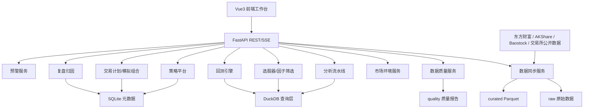

# 本地智能股票分析平台 PRD2

| 项目 | 内容 |
|---|---|
| 文档版本 | v2.0 |
| 项目代号 | Local Stock Analysis（LSA） |
| 文档状态 | 可执行需求稿 |
| 生成日期 | 2026-05-27 |
| 目标读者 | 产品、研发、测试、运维、量化研究、个人投资者 |
| 实现约束 | 本地优先；不能接券商柜台；不提供实盘交易；以公开数据源和本地存储为基础 |

## 1. 背景与目标

### 1.1 背景

当前项目已经具备本地股票分析工作台的主要骨架：

- Vue 3 + Element Plus 前端，包含分析驾驶舱、选股器、策略工坊、数据同步、预警、自选股等页面。
- FastAPI 后端，包含行情、技术指标、分析流水线、策略执行、选股、资讯、预警、同步调度等服务。
- 数据来源为东方财富、AKShare、Baostock，日 K 线以 pkl 缓存在本地，SQLite 保存配置、策略、运行记录、股票池和预警等元数据。
- 分析能力包含 MA、MACD、RSI、支撑压力、短中长方向卡、简单波动区间预测和策略脚本沙箱执行。

但距离一个可长期使用、可验证、可复盘、能辅助盈利的股票分析工具仍有明显差距。核心短板不是页面数量，而是数据可信度、策略可信度和盈利闭环。

### 1.2 产品目标

PRD2 的目标是把 LSA 从“能看、能跑”的分析工具升级为“数据可校验、策略可回测、结论可追溯、交易计划可复盘”的本地投研系统。

核心目标：

1. 建立本地数据仓：从 pkl 缓存升级为 SQLite + DuckDB + Parquet 的组合，支持批量查询、因子计算、回测和数据质量追踪。
2. 建立数据质量体系：每次分析前检查完整性、新鲜度、跨源一致性和复权一致性，输出数据质量等级。
3. 建立策略验证体系：选股、方向判断和用户策略都必须能回测、能比较、能看样本外表现。
4. 建立盈利闭环：从数据同步、市场环境、股票池筛选、单票分析、交易计划、预警、模拟记录到复盘归因形成完整流程。
5. 保持合规边界：不接券商柜台，不自动下单，不承诺收益，不输出“必涨必跌”表述。

### 1.3 非目标

以下能力不在 PRD2 范围内：

- 实盘下单、券商柜台、资金划转、委托撤单。
- 高频交易、毫秒级行情、真实 Level 2 盘口。
- 持牌投顾服务、代客理财、保证收益承诺。
- 多租户 SaaS、团队权限体系、商业化计费系统。
- 以 AI 直接替代数据校验、回测和风控。

## 2. 用户与使用场景

### 2.1 目标用户

| 用户 | 主要诉求 | 核心功能 |
|---|---|---|
| 趋势交易者 | 找到趋势延续和回调机会 | 多周期图表、市场环境、技术因子、预警、交易计划 |
| 波段投资者 | 判断中期方向和风险收益比 | 板块强度、支撑压力、回撤位置、策略回测 |
| 价值投资者 | 看基本面、估值和长期质量 | 财务数据、估值分位、行业对比、长线评分 |
| 量化爱好者 | 批量筛选、回测、因子验证 | 本地数据仓、因子库、选股器、回测引擎 |
| 复盘型用户 | 记录交易计划和错误模式 | 模拟组合、交易日志、复盘标签、策略修正 |

### 2.2 核心用户旅程

```text
首次使用：
启动服务 -> 同步股票列表 -> 全量/增量同步日 K -> 查看数据质量 -> 设置默认工作流

日常盘后分析：
每日同步 -> 查看市场环境 -> 运行选股器 -> 查看候选股 -> 单票深度分析
-> 生成交易计划 -> 设置预警 -> 次日人工执行 -> 手工/导入记录 -> 复盘归因

策略研究：
定义规则/上传策略 -> 选择股票池和时间范围 -> 回测 -> 查看收益与风险指标
-> 样本外验证 -> 参数修正 -> 保存版本 -> 绑定工作流
```

## 3. 产品边界与合规规则

### 3.1 分析输出规则

系统允许输出：

- 偏多、偏空、震荡、中性等方向判断。
- 置信度、依据链、反证、风险点。
- 价格区间、支撑压力、波动区间、情景假设。
- 交易计划模板：触发条件、失效条件、目标区间、仓位上限、观察项。
- 回测结果、历史统计、因子分层表现。

系统禁止输出：

- “保证盈利”“必涨”“必跌”“目标价必达”等确定性承诺。
- 自动下单或真实买卖按钮。
- 诱导满仓、借钱、加杠杆等风险行为。
- 将 AI 总结包装成事实或投资建议。

### 3.2 UI 提示规则

所有分析、预测、策略、计划、模拟组合页面必须展示：

```text
分析结论仅供研究和复盘，不构成投资建议；系统不提供实盘交易能力。
```

当数据质量等级为 C 时，页面必须显示黄色提示：“数据存在单源或轻微异常，结论仅供参考”。

当数据质量等级为 D 时，页面必须显示红色提示，并禁止输出方向判断：“数据缺失或冲突严重，本次不生成方向结论”。

## 4. 总体架构

### 4.1 目标架构



### 4.2 存储分层

| 层级 | 存储 | 用途 |
|---|---|---|
| raw | JSON/CSV/Parquet 文件 | 原始接口返回，保留来源和拉取时间 |
| curated | Parquet | 标准化行情、财务、事件、因子 |
| query | DuckDB | 本地分析查询、批量选股、回测聚合 |
| metadata | SQLite | 配置、任务、策略、运行记录、交易计划、复盘 |
| cache | pkl，可逐步迁移 | 兼容现有 K 线缓存 |

### 4.3 推荐目录结构

```text
data/
  raw/
    eastmoney/
      klines/
      moneyflow/
    akshare/
      klines/
      fundamentals/
      news/
    baostock/
      klines/
  curated/
    daily_bars.parquet
    stock_universe.parquet
    trade_calendar.parquet
    corporate_actions.parquet
    fundamentals.parquet
    valuation.parquet
    moneyflow.parquet
    events.parquet
    factors.parquet
  quality/
    daily_quality_report.parquet
    source_compare_report.parquet
  backtests/
    runs/
  exports/
  lsa.db
```

## 5. 数据需求

### 5.1 数据域

| 数据域 | Phase | 必须字段 | 来源建议 |
|---|---|---|---|
| 股票列表 | P0 | symbol、name、board、is_st、listed_date、delisted_date | AKShare、交易所、东方财富 |
| 交易日历 | P0 | trade_date、is_open、market | 交易所、AKShare |
| 日 K | P0 | symbol、trade_date、open、high、low、close、volume、amount、adjust、source | 东方财富、AKShare、Baostock |
| 指数 K 线 | P0 | index_code、trade_date、OHLCV | AKShare、东方财富 |
| 行业/板块 | P1 | industry_code、name、members、effective_date | 申万/东方财富/AKShare |
| 资金流 | P1 | symbol、trade_date、main_net_inflow、super_large、large、medium、small | 东方财富公开口径 |
| 财务报表 | P1 | report_period、revenue、net_profit、roe、gross_margin、debt_ratio、ocf | 巨潮/交易所/AKShare |
| 估值 | P1 | pe_ttm、pb、ps、dividend_yield、percentile | AKShare/东方财富 |
| 事件公告 | P1 | symbol、event_date、type、title、url、source | 巨潮、交易所、AKShare |
| 回测结果 | P0 | run_id、strategy_id、period、metrics、equity_curve、trades | 系统生成 |
| 交易计划 | P0 | plan_id、symbol、trigger、invalid、target、risk、status | 用户输入 |
| 复盘记录 | P0 | review_id、plan_id、pnl、tags、lesson、created_at | 用户输入 |

### 5.2 标准日 K 表

`daily_bars.parquet` 字段：

| 字段 | 类型 | 说明 |
|---|---|---|
| symbol | string | 6 位股票代码 |
| trade_date | date | 交易日 |
| open | double | 开盘价 |
| high | double | 最高价 |
| low | double | 最低价 |
| close | double | 收盘价 |
| volume | double | 成交量 |
| amount | double | 成交额 |
| adjust | string | raw/qfq/hfq |
| source | string | eastmoney/akshare/baostock/merged |
| source_count | int | 参与合并的数据源数量 |
| quality_level | string | A/B/C/D |
| updated_at | timestamp | 标准化更新时间 |

唯一键：`symbol + trade_date + adjust`

### 5.3 数据质量规则

| 规则 | 触发条件 | 等级影响 |
|---|---|---|
| 缺交易日 | 交易日历开市但无 bar，且非停牌 | 降到 C 或 D |
| OHLC 不合理 | high < open/close 或 low > open/close | D |
| 成交量异常 | volume < 0 或 amount < 0 | D |
| 跨源价格冲突 | close 差异 > 0.3% | C；差异 > 1% 为 D |
| 最新数据滞后 | 最新交易日缺失 | B/C，视延迟天数 |
| 单源数据 | 只有一个来源 | C |
| 复权混用 | 同一分析混用 qfq/raw | D |

### 5.4 数据质量等级

| 等级 | 定义 | 产品行为 |
|---|---|---|
| A | 多源一致、完整、最新 | 正常分析 |
| B | 小缺失或两源一致 | 正常分析，显示轻提示 |
| C | 单源或存在轻微异常 | 输出分析但弱化置信度 |
| D | 缺失/冲突严重 | 禁止输出方向结论 |

## 6. 核心模块需求

### 6.1 M1 数据同步与数据仓

目标：把现有 pkl 缓存升级为可查询、可校验、可追溯的本地数据仓。

功能需求：

| ID | 需求 | 优先级 | 验收标准 |
|---|---|---|---|
| M1-01 | 支持股票列表同步，并记录新增、改名、退市、ST 变化 | P0 | 同步后可查看 delta 摘要 |
| M1-02 | 支持日 K 全量同步和增量同步 | P0 | 首次全量可断点续传；增量只补缺失日期 |
| M1-03 | 每次同步先保存 raw 原始数据 | P0 | raw 目录能按 source/symbol/date 找到原始结果 |
| M1-04 | 标准化写入 curated Parquet | P0 | DuckDB 能查询 daily_bars |
| M1-05 | 保留现有 pkl 读取兼容 | P0 | 旧驾驶舱功能不因迁移中断 |
| M1-06 | 数据同步页面显示 raw/curated/quality 三段进度 | P1 | 前端能展示当前阶段和错误 |
| M1-07 | 支持只同步自选股/自定义股票池 | P1 | 用户可选择范围 |

后端建议接口：

```text
GET  /api/v1/data/status
POST /api/v1/data/sync/universe
POST /api/v1/data/sync/daily-bars
GET  /api/v1/data/sync/jobs/{job_id}
GET  /api/v1/data/coverage
GET  /api/v1/data/raw/{source}/{symbol}
```

前端页面：

- `数据同步` 页面增加数据仓状态卡。
- 增加“覆盖率”“最新交易日”“异常数量”“跨源冲突数量”。
- 增加同步范围选择：全市场、自选股、自定义股票池、单标的。

### 6.2 M2 数据质量中心

目标：让每次分析之前都知道数据是否可信。

功能需求：

| ID | 需求 | 优先级 | 验收标准 |
|---|---|---|---|
| M2-01 | 每日同步后自动生成质量报告 | P0 | 有 daily_quality_report.parquet |
| M2-02 | 单标的分析前返回质量等级 | P0 | 分析响应包含 quality_level |
| M2-03 | 支持跨源对账 | P0 | close/volume/amount 差异超阈值可查询 |
| M2-04 | 支持质量问题明细 | P1 | 前端能看到缺失日期、异常字段、冲突来源 |
| M2-05 | D 级数据阻断方向结论 | P0 | D 级时方向卡显示阻断原因 |

后端建议接口：

```text
GET /api/v1/quality/summary
GET /api/v1/quality/symbol/{symbol}
GET /api/v1/quality/conflicts
GET /api/v1/quality/missing-bars
```

### 6.3 M3 市场环境分析

目标：在个股分析前先判断市场状态，避免脱离大盘和板块环境。

功能需求：

| ID | 需求 | 优先级 | 验收标准 |
|---|---|---|---|
| M3-01 | 指数趋势卡：上证、深成指、创业板、科创、沪深 300、中证 500/1000 | P0 | 展示 MA20/MA60、涨跌幅、趋势状态 |
| M3-02 | 市场宽度：上涨家数、涨停跌停、20 日新高新低、均线多头比例 | P1 | 每日盘后可计算 |
| M3-03 | 板块强度：行业涨跌、相对强度、强势板块列表 | P1 | 可按 5/20/60 日排序 |
| M3-04 | 环境评级：强势、震荡、弱势、风险 | P0 | 个股分析响应带 market_regime |
| M3-05 | 市场环境过滤器可绑定策略 | P1 | 回测时可选择是否启用 |

输出示例：

```json
{
  "market_regime": "risk",
  "score": 42,
  "summary": "指数处于 MA20 下方，市场宽度偏弱，建议降低候选股权重",
  "evidence": [
    {"name": "沪深300", "value": "close < ma20"},
    {"name": "涨跌家数", "value": "下跌家数占比 68%"}
  ]
}
```

### 6.4 M4 分析流水线升级

目标：把现有七阶段流水线升级为带数据质量、市场环境、计划建议和审计链的流水线。

目标阶段：

```text
ingest -> quality -> market -> feature -> strategy -> backtest_context
-> direction -> plan -> present
```

功能需求：

| ID | 需求 | 优先级 | 验收标准 |
|---|---|---|---|
| M4-01 | 新增 quality 阶段 | P0 | D 级数据自动停止方向生成 |
| M4-02 | 新增 market 阶段 | P0 | 单票分析结果包含市场环境 |
| M4-03 | feature 阶段读取 DuckDB/Parquet | P0 | 不再只依赖 pkl |
| M4-04 | strategy 阶段输出信号和解释 | P0 | 策略输出结构化 signal/score/reason |
| M4-05 | plan 阶段生成交易计划草稿 | P1 | 包含触发、失效、目标、风险 |
| M4-06 | 每个阶段记录输入 hash、输出摘要、耗时、数据版本 | P1 | 运行详情可审计 |
| M4-07 | 保持 SSE 流式进度与断点续跑 | P0 | 前端进度不回退 |

分析响应必须包含：

```json
{
  "quality": {},
  "market": {},
  "indicators": {},
  "strategy_output": {},
  "directions": {},
  "plan_draft": {},
  "lineage": {},
  "disclaimer": "分析结论仅供研究和复盘，不构成投资建议"
}
```

### 6.5 M5 指标与因子库

目标：从少量技术指标扩展为可回测、可排序、可解释的因子库。

P0 指标：

- MA：MA5、MA10、MA20、MA60、MA120、MA250。
- MACD：DIF、DEA、MACD、金叉/死叉状态。
- RSI：RSI6、RSI12、RSI24。
- 成交量：量比、5 日/20 日均量、放量/缩量。
- 波动率：20 日、60 日历史波动率。
- 收益率：1 日、5 日、20 日、60 日收益率。
- 位置：近 20/60/120 日价格分位。

P1 因子：

- 趋势强度：均线排列、突破、回撤。
- 相对强度：个股相对指数、个股相对行业。
- 资金流：主力净流入、连续流入天数。
- 估值分位：PE/PB 历史分位和行业分位。
- 质量因子：ROE、毛利率、现金流、负债率。

功能需求：

| ID | 需求 | 优先级 | 验收标准 |
|---|---|---|---|
| M5-01 | 因子计算结果写入 factors.parquet | P0 | 可按 symbol/date 查询 |
| M5-02 | 选股器支持因子排序 | P0 | 可按 RSI、收益率、波动率排序 |
| M5-03 | 因子有计算公式说明 | P1 | 前端可展开查看 |
| M5-04 | 因子支持批量重算 | P0 | 同步后自动计算新增日期 |
| M5-05 | 因子可参与回测 | P0 | 回测可选择 top N 或阈值条件 |

### 6.6 M6 选股器升级

目标：从“预设交集命中”升级为“条件筛选 + 因子排序 + 一键回测”的研究工具。

功能需求：

| ID | 需求 | 优先级 | 验收标准 |
|---|---|---|---|
| M6-01 | 支持条件组 AND/OR | P0 | 可配置多组条件 |
| M6-02 | 支持因子排序和 Top N | P0 | 例如按 20 日相对强度取前 50 |
| M6-03 | 支持股票池范围 | P0 | 全市场、自选、板块、自定义 |
| M6-04 | 支持保存筛选策略 | P1 | 下次可复用 |
| M6-05 | 命中结果支持一键回测 | P0 | 跳转回测页面并带入条件 |
| M6-06 | 结果展示关键指标和数据质量 | P0 | 表格展示 quality_level |
| M6-07 | 扫描时优先使用本地数据仓 | P0 | 默认不访问外网 |

筛选条件结构：

```json
{
  "groups": [
    {
      "logic": "AND",
      "conditions": [
        {"field": "close_above_ma20", "op": "eq", "value": true},
        {"field": "rsi12", "op": "lt", "value": 60}
      ]
    }
  ],
  "sort": [{"field": "relative_strength_20d", "direction": "desc"}],
  "limit": 50
}
```

### 6.7 M7 回测引擎

目标：验证策略是否具备正期望，避免只靠主观方向判断。

回测范围：

- 单标的策略回测。
- 选股策略组合回测。
- 固定调仓周期：日、周、月。
- 基础交易成本：佣金、印花税、滑点。
- A 股限制：涨跌停不可买入/卖出、停牌不可交易。

功能需求：

| ID | 需求 | 优先级 | 验收标准 |
|---|---|---|---|
| M7-01 | 支持选股策略回测 | P0 | 输入筛选条件可生成组合收益曲线 |
| M7-02 | 支持单策略 Python 回测 | P1 | 用户策略 run(ctx) 可输出 signal |
| M7-03 | 支持成本和滑点配置 | P0 | 默认含佣金、印花税、滑点 |
| M7-04 | 支持涨跌停/停牌处理 | P0 | 不能成交时记录 skipped trade |
| M7-05 | 输出核心指标 | P0 | 年化、最大回撤、夏普、胜率、盈亏比、换手 |
| M7-06 | 输出交易明细和权益曲线 | P0 | 可导出 CSV |
| M7-07 | 支持样本内/样本外切分 | P1 | 可指定切分日期 |
| M7-08 | 支持参数对比 | P1 | 同一策略不同参数指标对比 |

回测指标：

| 指标 | 说明 |
|---|---|
| total_return | 总收益 |
| annual_return | 年化收益 |
| max_drawdown | 最大回撤 |
| sharpe | 夏普比率 |
| win_rate | 胜率 |
| profit_loss_ratio | 盈亏比 |
| turnover | 换手率 |
| exposure | 持仓暴露 |
| trade_count | 交易次数 |
| avg_holding_days | 平均持有天数 |

后端建议接口：

```text
POST /api/v1/backtests/run
GET  /api/v1/backtests/runs
GET  /api/v1/backtests/runs/{run_id}
GET  /api/v1/backtests/runs/{run_id}/trades
GET  /api/v1/backtests/runs/{run_id}/export
```

### 6.8 M8 策略平台升级

目标：让策略从“可上传”变成“可验证、可修正、可比较、可回滚”。

功能需求：

| ID | 需求 | 优先级 | 验收标准 |
|---|---|---|---|
| M8-01 | 策略必须声明输入、输出和适用周期 | P0 | 上传后可解析 metadata |
| M8-02 | 策略输出统一结构 | P0 | signal、score、reason、risk |
| M8-03 | 策略版本保存参数快照 | P0 | 回测能复现历史版本 |
| M8-04 | 策略修正必须触发回测对比 | P1 | 保存前显示新旧指标差异 |
| M8-05 | 支持策略禁用/启用 | P0 | 禁用后工作流不可选择 |
| M8-06 | 沙箱执行限制文件和网络访问 | P1 | 默认无网络、超时、限制 cwd |
| M8-07 | 策略详情显示最近回测结果 | P1 | 版本列表带关键指标 |

策略输出标准：

```json
{
  "signal": "watch|long|avoid|neutral",
  "score": 0.72,
  "horizon": "short|medium|long",
  "reasons": ["价格站上 MA20", "MACD 柱转正"],
  "risks": ["RSI 接近超买"],
  "params": {}
}
```

### 6.9 M9 交易计划与模拟组合

目标：在不能接券商柜台的前提下，建立“人工执行 + 系统复盘”的盈利闭环。

交易计划不是下单指令，只是研究和复盘记录。

功能需求：

| ID | 需求 | 优先级 | 验收标准 |
|---|---|---|---|
| M9-01 | 单票分析结果可生成计划草稿 | P0 | 包含触发价、失效价、目标价、仓位上限 |
| M9-02 | 用户可手动编辑计划 | P0 | 保存到 SQLite |
| M9-03 | 计划可绑定预警 | P0 | 触发价/失效价自动生成预警 |
| M9-04 | 支持计划状态 | P0 | draft、watching、triggered、opened、closed、cancelled |
| M9-05 | 支持模拟成交记录 | P0 | 用户手动录入买卖价格、数量、时间 |
| M9-06 | 支持模拟组合收益统计 | P1 | 展示持仓、盈亏、回撤、仓位 |
| M9-07 | 支持导入 CSV 交易记录 | P1 | 不接券商，但可从用户导出文件导入 |

计划字段：

| 字段 | 说明 |
|---|---|
| plan_id | 计划 ID |
| symbol | 股票代码 |
| horizon | short/medium/long |
| trigger_price | 触发价 |
| invalid_price | 失效价 |
| target_price_1 | 第一目标 |
| target_price_2 | 第二目标 |
| max_position_pct | 仓位上限 |
| risk_reward_ratio | 收益风险比 |
| rationale | 计划依据 |
| risks | 风险点 |
| status | 状态 |

### 6.10 M10 复盘归因

目标：记录每次计划和交易的结果，把错误模式转化为策略修正依据。

功能需求：

| ID | 需求 | 优先级 | 验收标准 |
|---|---|---|---|
| M10-01 | 已关闭计划必须可复盘 | P0 | 填写结果、标签、总结 |
| M10-02 | 支持错误标签 | P0 | 追高、止损慢、环境差、信号失效、数据异常等 |
| M10-03 | 自动计算计划执行偏差 | P1 | 实际入场/出场与计划差异 |
| M10-04 | 按策略/标签统计盈亏 | P1 | 看哪些策略和错误最影响收益 |
| M10-05 | 复盘结果反哺策略修正 | P1 | 策略详情显示相关复盘 |

复盘标签：

- `chased_high`：追高。
- `late_stop_loss`：止损慢。
- `ignored_market_regime`：忽视市场环境。
- `signal_failed`：信号失效。
- `data_quality_issue`：数据质量问题。
- `news_shock`：消息冲击。
- `position_too_large`：仓位过重。
- `did_not_follow_plan`：未按计划执行。

### 6.11 M11 预警升级

目标：从简单价格/指标预警升级为计划、选股、事件、数据质量预警。

功能需求：

| ID | 需求 | 优先级 | 验收标准 |
|---|---|---|---|
| M11-01 | 支持计划触发价和失效价预警 | P0 | 计划保存后可自动创建 |
| M11-02 | 支持组合条件预警 | P1 | 价格 + 指标 + 数据质量 |
| M11-03 | 支持选股器命中新标的预警 | P1 | 每日扫描后有新增命中提醒 |
| M11-04 | 支持数据质量异常预警 | P1 | D 级数据通知 |
| M11-05 | 支持冷却时间和重复触发策略 | P0 | 避免刷屏 |

### 6.12 M12 基本面与估值

目标：补齐中长线分析所需的财务和估值基础。

P1 功能需求：

| ID | 需求 | 优先级 | 验收标准 |
|---|---|---|---|
| M12-01 | 同步利润表、资产负债表、现金流 | P1 | 可按 symbol/report_period 查询 |
| M12-02 | 计算基础财务指标 | P1 | ROE、毛利率、净利率、负债率、经营现金流 |
| M12-03 | 同步 PE/PB/PS/股息率 | P1 | 可展示历史分位 |
| M12-04 | 长线方向卡增加基本面依据 | P1 | 不再只依赖 MA60/120 日收益 |
| M12-05 | 同行业对比 | P2 | 展示行业分位 |

### 6.13 M13 资讯与事件

目标：把新闻/公告从列表升级为可筛选、可归类、可纳入风险提示的事件系统。

功能需求：

| ID | 需求 | 优先级 | 验收标准 |
|---|---|---|---|
| M13-01 | 新闻和公告落地 events.parquet | P1 | 可按 symbol/date/source 查询 |
| M13-02 | 公告类型分类 | P1 | 业绩、减持、回购、分红、解禁、诉讼等 |
| M13-03 | 事件时间线接入分析流水线 | P1 | 方向卡显示近期重大风险事件 |
| M13-04 | 支持事件预警 | P2 | 特定类型公告触发提醒 |
| M13-05 | AI 摘要可选开启 | P2 | 必须显示来源和原文链接 |

### 6.14 M14 报告与导出

目标：把日常分析沉淀为可复查的报告。

功能需求：

| ID | 需求 | 优先级 | 验收标准 |
|---|---|---|---|
| M14-01 | 单票分析可导出 Markdown/JSON | P0 | 包含数据质量、方向、计划、风险 |
| M14-02 | 选股结果可导出 CSV | P0 | 包含命中原因和关键因子 |
| M14-03 | 回测结果可导出 CSV/JSON | P0 | 权益曲线和交易明细可导出 |
| M14-04 | 生成每日复盘报告 | P1 | 自选变化、预警、候选、计划、风险 |
| M14-05 | 生成策略评估报告 | P1 | 回测指标、样本外、参数对比 |

## 7. 页面需求

### 7.1 页面总览

| 页面 | 当前状态 | PRD2 改造 |
|---|---|---|
| 分析驾驶舱 | 已有 | 增加数据质量、市场环境、计划草稿、审计链 |
| 选股器 | 已有 | 增加条件组、因子排序、一键回测 |
| 策略工坊 | 已有 | 增加策略 metadata、版本回测对比、启停状态 |
| 数据同步 | 已有 | 增加数据仓、质量报告、覆盖率、raw/curated 进度 |
| 预警 | 已有 | 增加计划预警、组合条件预警 |
| 自选股 | 已有 | 增加分组策略、批量分析、批量计划 |
| 回测中心 | 新增 | 回测配置、运行历史、结果详情 |
| 交易计划 | 新增 | 计划列表、计划详情、状态流转 |
| 模拟组合 | 新增 | 持仓、收益、交易记录、风险 |
| 复盘中心 | 新增 | 复盘表单、标签统计、错误归因 |
| 数据质量 | 新增 | 质量总览、异常明细、跨源冲突 |
| 市场环境 | 新增 | 指数、宽度、板块强度、市场评级 |

### 7.2 分析驾驶舱布局

首屏必须包含：

- 标的搜索。
- 数据质量徽标。
- 市场环境徽标。
- 短/中/长方向卡。
- 关键支撑压力。
- 计划草稿入口。
- 分析流水线进度。

页面下方：

- K 线图与指标。
- 新闻/公告事件。
- 策略输出。
- 运行历史。
- 数据血缘与公式说明。

### 7.3 回测中心布局

配置区：

- 股票池范围。
- 策略/筛选条件。
- 回测时间。
- 调仓周期。
- 成本与滑点。
- 市场环境过滤器开关。

结果区：

- 核心指标卡。
- 权益曲线。
- 回撤曲线。
- 月度收益热力图。
- 交易明细。
- 参数对比。

## 8. 后端数据模型

### 8.1 SQLite 新增表

#### backtest_runs

| 字段 | 类型 | 说明 |
|---|---|---|
| run_id | TEXT PK | 回测 ID |
| name | TEXT | 回测名称 |
| strategy_id | TEXT | 策略 ID |
| filters_json | TEXT | 筛选条件 |
| config_json | TEXT | 成本、时间、调仓 |
| metrics_json | TEXT | 指标 |
| result_path | TEXT | 结果文件路径 |
| created_at | TEXT | 创建时间 |

#### trade_plans

| 字段 | 类型 | 说明 |
|---|---|---|
| id | TEXT PK | 计划 ID |
| symbol | TEXT | 股票代码 |
| horizon | TEXT | 周期 |
| trigger_price | REAL | 触发价 |
| invalid_price | REAL | 失效价 |
| target_price_1 | REAL | 第一目标 |
| target_price_2 | REAL | 第二目标 |
| max_position_pct | REAL | 仓位上限 |
| rationale_json | TEXT | 依据 |
| risks_json | TEXT | 风险 |
| status | TEXT | 状态 |
| source_run_id | TEXT | 来源分析运行 |
| created_at | TEXT | 创建时间 |
| updated_at | TEXT | 更新时间 |

#### simulated_trades

| 字段 | 类型 | 说明 |
|---|---|---|
| id | TEXT PK | 交易记录 ID |
| plan_id | TEXT | 计划 ID |
| symbol | TEXT | 股票代码 |
| side | TEXT | buy/sell |
| price | REAL | 成交价 |
| quantity | REAL | 数量 |
| fee | REAL | 成本 |
| traded_at | TEXT | 成交时间 |
| note | TEXT | 备注 |

#### reviews

| 字段 | 类型 | 说明 |
|---|---|---|
| id | TEXT PK | 复盘 ID |
| plan_id | TEXT | 计划 ID |
| pnl | REAL | 盈亏 |
| pnl_pct | REAL | 盈亏比例 |
| tags_json | TEXT | 复盘标签 |
| lesson | TEXT | 复盘总结 |
| created_at | TEXT | 创建时间 |

#### strategy_backtest_refs

| 字段 | 类型 | 说明 |
|---|---|---|
| id | TEXT PK | 记录 ID |
| strategy_id | TEXT | 策略 ID |
| revision_id | TEXT | 修订 ID |
| backtest_run_id | TEXT | 回测 ID |
| metrics_json | TEXT | 指标快照 |
| created_at | TEXT | 创建时间 |

### 8.2 Parquet 文件

| 文件 | 主键 | 用途 |
|---|---|---|
| daily_bars.parquet | symbol + trade_date + adjust | 标准日 K |
| stock_universe.parquet | symbol | 股票池 |
| trade_calendar.parquet | market + trade_date | 交易日历 |
| factors.parquet | symbol + trade_date + factor_name | 因子 |
| quality_report.parquet | symbol + trade_date | 数据质量 |
| events.parquet | symbol + event_date + event_id | 事件 |
| fundamentals.parquet | symbol + report_period | 财务 |

## 9. API 需求总览

### 9.1 数据与质量

```text
GET  /api/v1/data/status
POST /api/v1/data/sync
GET  /api/v1/data/jobs/{job_id}
GET  /api/v1/data/coverage
GET  /api/v1/quality/summary
GET  /api/v1/quality/symbol/{symbol}
GET  /api/v1/quality/conflicts
```

### 9.2 市场环境

```text
GET /api/v1/market/regime
GET /api/v1/market/breadth
GET /api/v1/market/indices
GET /api/v1/market/sectors
```

### 9.3 分析

```text
POST /api/v1/analysis/run
POST /api/v1/analysis/run/stream
GET  /api/v1/analysis/runs
GET  /api/v1/analysis/runs/{run_id}
POST /api/v1/analysis/runs/{run_id}/plan
GET  /api/v1/analysis/runs/{run_id}/lineage
```

### 9.4 选股与因子

```text
POST /api/v1/screener/run
POST /api/v1/screener/run/stream
GET  /api/v1/screener/runs/{run_id}
POST /api/v1/screener/runs/{run_id}/backtest
GET  /api/v1/factors/catalog
POST /api/v1/factors/recompute
```

### 9.5 回测

```text
POST /api/v1/backtests/run
POST /api/v1/backtests/run/stream
GET  /api/v1/backtests/runs
GET  /api/v1/backtests/runs/{run_id}
GET  /api/v1/backtests/runs/{run_id}/trades
GET  /api/v1/backtests/runs/{run_id}/export
```

### 9.6 计划、模拟、复盘

```text
GET    /api/v1/plans
POST   /api/v1/plans
GET    /api/v1/plans/{plan_id}
PATCH  /api/v1/plans/{plan_id}
POST   /api/v1/plans/{plan_id}/alerts
POST   /api/v1/simulated-trades
GET    /api/v1/portfolio/simulated
POST   /api/v1/reviews
GET    /api/v1/reviews
GET    /api/v1/reviews/stats
```

## 10. 非功能需求

### 10.1 性能

| 场景 | 目标 |
|---|---|
| 单标的分析，已有本地数据 | 3 秒内返回首屏结果 |
| 单标的质量检查 | 500 ms 内返回 |
| 选股器扫描 5000 只股票 | 使用本地数据时 60 秒内完成基础因子筛选 |
| 回测 5 年日频 500 只股票 | 120 秒内完成基础策略回测 |
| 前端首屏加载 | 2 秒内显示骨架屏和基础状态 |

### 10.2 稳定性

- 数据同步必须支持断点续传。
- 长任务必须通过 SSE 返回进度。
- 后端重启后，已完成任务结果可查询。
- 同步任务必须有并发锁，避免重复写入。
- 任一数据源失败时不影响其他数据源尝试。

### 10.3 可观测性

- 每个同步任务记录 job_id、开始时间、结束时间、状态、成功数、失败数。
- 每个分析任务记录 run_id、阶段日志、输入数据版本、输出摘要。
- 每个回测任务记录参数、数据范围、策略版本和结果路径。
- 错误日志必须包含 source、symbol、stage、exception。

### 10.4 安全

- 用户策略默认无网络权限。
- 策略执行有超时限制。
- 上传文件只允许 `.py`、`.zip`，并限制解压路径穿越。
- API 不执行任意 shell 命令。
- 本地数据默认不上传外部服务。

## 11. 验收标准

### 11.1 Phase 0：数据与回测底座

必须完成：

- DuckDB + Parquet 查询层可用。
- 日 K 标准表可写入、可查询。
- 数据质量报告可生成。
- 单标的分析返回 quality_level。
- 选股器默认读取本地数据仓。
- 基础回测引擎可跑选股策略。
- 回测输出收益曲线、最大回撤、胜率、交易明细。

验收用例：

1. 同步 000001、600519、300750 三只股票近 5 年日 K。
2. 生成 daily_bars.parquet 和 quality_report.parquet。
3. 运行 MA20 上穿策略回测。
4. 查看回测指标和交易明细。
5. 在分析驾驶舱看到数据质量等级。

### 11.2 Phase 1：盈利闭环

必须完成：

- 单票分析生成计划草稿。
- 用户可保存、编辑、取消计划。
- 计划可生成预警。
- 用户可手动记录模拟成交。
- 关闭计划后可填写复盘。
- 复盘标签可统计。

验收用例：

1. 对 600519 运行分析。
2. 生成并保存一个中线计划。
3. 自动创建触发价和失效价预警。
4. 手动录入一次模拟买入和卖出。
5. 关闭计划并填写复盘标签。
6. 复盘中心能统计该标签出现次数和盈亏。

### 11.3 Phase 2：市场环境与因子增强

必须完成：

- 市场环境页面可查看指数趋势和宽度。
- 个股分析包含 market_regime。
- 因子库支持批量计算。
- 选股器支持因子排序和 Top N。
- 回测可启用市场环境过滤器。

### 11.4 Phase 3：基本面、事件与报告

必须完成：

- 财务与估值数据可同步。
- 长线方向卡纳入财务和估值依据。
- 事件公告落地并展示。
- 单票分析、选股结果、回测结果可导出。
- 生成每日复盘报告。

## 12. 实施路线

### 12.1 技术实施顺序

1. 引入 DuckDB 和 Parquet 依赖。
2. 实现 daily_bars 标准写入与查询。
3. 实现数据质量服务。
4. 改造分析流水线接入 quality 阶段。
5. 改造选股器从数据仓读取。
6. 实现基础回测引擎。
7. 新增回测中心页面。
8. 新增交易计划、模拟交易、复盘表。
9. 分析驾驶舱增加计划草稿。
10. 预警系统接入计划。
11. 增加市场环境服务。
12. 扩展因子库和选股器。
13. 补基本面与事件。
14. 补报告导出。

### 12.2 兼容策略

- 不一次性删除 pkl 缓存，先做双读：优先 Parquet，缺失时回落 pkl。
- 现有 SQLite 表保留，新增表通过 `CREATE TABLE IF NOT EXISTS` 迁移。
- 现有 API 不破坏，新增字段向后兼容。
- 前端先显示新增字段，字段缺失时显示占位。

## 13. 风险与应对

| 风险 | 影响 | 应对 |
|---|---|---|
| 公开数据源不稳定 | 同步失败、数据缺失 | 多源 failover、raw 留存、质量等级 |
| 数据量变大 | 扫描变慢 | DuckDB + Parquet、增量计算、缓存因子 |
| 回测过拟合 | 策略误导 | 强制样本外、滚动区间、成本滑点 |
| 用户误解为投资建议 | 合规风险 | 页面提示、禁止确定性语言、无交易入口 |
| 策略沙箱风险 | 本地安全 | 限制文件、网络、超时、路径 |
| 功能膨胀 | 交付延期 | Phase 分层，先做数据和回测底座 |

## 14. 成功指标

### 14.1 产品指标

- 每日同步成功率 >= 95%。
- 日 K 最新交易日覆盖率 >= 98%。
- 单标的分析本地数据命中率 >= 90%。
- D 级数据阻断率 100%。
- 选股结果一键回测使用率 >= 50%。
- 已创建计划中完成复盘比例 >= 60%。

### 14.2 策略指标

- 每个保存策略至少有一次回测结果。
- 策略页面显示样本内和样本外指标。
- 参数修正前后指标可比较。
- 每个策略可查看最大回撤、胜率、盈亏比和交易次数。

### 14.3 用户行为指标

- 分析后创建计划比例。
- 预警触发后计划状态更新比例。
- 已关闭计划复盘完成率。
- 高频错误标签下降趋势。

## 15. 最小可交付版本定义

PRD2 的 MVP 不追求一次性补齐全部专业终端能力，最小可交付版本定义为：

1. 本地日 K 数据仓可用。
2. 数据质量等级可用，并接入分析结果。
3. 选股器可基于本地因子运行。
4. 基础回测可验证选股策略。
5. 单票分析可生成交易计划草稿。
6. 用户可手工记录模拟交易和复盘。

达到以上 6 点后，LSA 才从“分析展示工具”进入“可验证投研闭环工具”的阶段。

