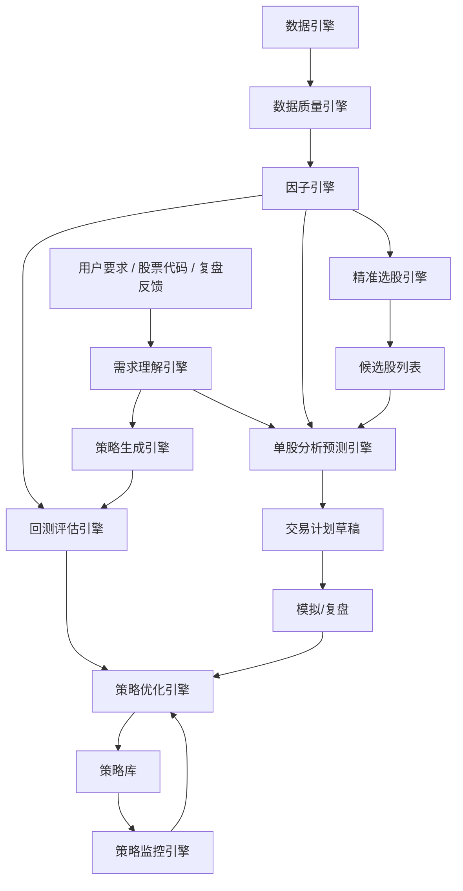

# 智能选股与策略自进化系统 PRD

| 项目 | 内容 |
|---|---|
| 文档版本 | v1.0 |
| 文档状态 | 产品方向重定义 / 可执行规划稿 |
| 生成日期 | 2026-06-06 |
| 目标系统 | 能按用户要求精准选股、单股深度分析预测、自动生成策略、自动回测、自动优化策略的本地智能投研系统 |
| 约束 | 不接券商柜台；不自动实盘交易；不承诺收益；本地优先；公开数据源优先，可扩展付费数据 |

## 1. 背景与问题

当前项目已经具备股票分析工作台的基础功能，包括行情、K 线、分析流水线、选股器、策略工坊、回测、交易计划、模拟组合、复盘和预警。但它与最初设想仍有明显差异。

最初想要的系统不是一个“功能页面集合”，而是一个能完成智能研究闭环的系统：

```text
用户提出选股/分析目标
-> 系统理解要求
-> 自动构造选股逻辑
-> 自动生成候选策略
-> 拉取并校验数据
-> 批量选股
-> 单股深度分析与预测
-> 自动回测验证
-> 自动优化参数和规则
-> 保存可复用策略
-> 持续跟踪策略表现并自我修正
```

因此，本 PRD 将产品方向重新定义为：

> **智能选股与策略自进化系统**：一个能够根据用户要求生成策略、验证策略、优化策略，并对单只股票进行多维度精准分析预测的本地智能系统。

## 2. 产品定位

### 2.1 一句话定位

根据用户要求自动构建选股策略，基于高质量数据进行单股深度分析与预测，并通过回测和持续复盘不断优化自身策略的智能投研系统。

### 2.2 核心目标

1. **精准选股**  
   用户可以用自然语言或结构化条件表达选股要求，系统自动转化为可执行的因子条件、股票池过滤、排序规则和风险约束。

2. **单股精准分析预测**  
   系统对单只股票进行数据质量、市场环境、行业强弱、技术结构、资金流、财务估值、事件风险、历史相似样本等多维分析，输出可解释结论。

3. **自动产生策略**  
   系统根据用户目标自动生成多个候选策略，包括入场条件、过滤条件、退出条件、仓位规则和风控规则。

4. **自动回测验证**  
   每个策略必须自动完成样本内、样本外、滚动区间和不同市场状态下的回测验证。

5. **自动优化自身策略**  
   系统根据回测、模拟表现、复盘标签和策略衰减信号自动调参、剔除无效因子、标记过拟合、推荐更优版本。

6. **形成可持续策略库**  
   策略不是一次性结果，而是可版本化、可比较、可跟踪、可淘汰、可进化的资产。

### 2.3 非目标

系统不做：

- 实盘自动交易。
- 券商柜台接入。
- 高频交易或毫秒级盘口交易。
- 保证收益或荐股承诺。
- 代替用户做最终投资决策。

## 3. 产品原则

1. **策略优先于页面**  
   所有功能围绕策略生成、验证、优化展开，页面只是策略工作流的承载。

2. **数据质量先于分析结论**  
   数据质量不达标时，系统不得输出高置信度结论。

3. **回测先于信号推荐**  
   没有历史验证的选股逻辑只能作为“候选想法”，不能升级为“策略”。

4. **样本外表现先于样本内收益**  
   系统必须警惕过拟合，优先选择样本外稳定的策略。

5. **风险收益比先于涨跌判断**  
   输出不应只是“偏多/偏空”，而应包含胜率、赔率、失效条件、最大回撤、适用市场状态。

6. **自我进化必须可解释**  
   系统每次策略调整都必须记录调整原因、前后指标变化和是否通过验证。

7. **AI 是研究助理，不是事实源**  
   AI 可用于理解需求、生成策略候选、总结报告，但数据和结论必须可追溯。

## 4. 目标用户

| 用户 | 诉求 | 系统价值 |
|---|---|---|
| 主观交易者 | 想把自己的经验变成可验证规则 | 将自然语言交易想法转成策略并回测 |
| 波段投资者 | 想按条件精准筛选机会 | 多因子选股、行业强弱和市场环境过滤 |
| 量化爱好者 | 想快速验证策略 | 自动生成策略、批量回测、参数优化 |
| 价值投资者 | 想做单股深度分析 | 财务、估值、行业、事件、技术综合分析 |
| 复盘型用户 | 想让系统越用越懂自己 | 复盘标签反哺策略优化 |

## 5. 核心工作流

### 5.1 智能选股工作流

```text
输入要求
-> 需求解析
-> 条件结构化
-> 因子匹配
-> 数据质量检查
-> 股票池过滤
-> 因子打分与排序
-> 候选股列表
-> 命中原因解释
-> 一键回测
-> 策略保存
```

示例输入：

```text
帮我找最近 20 个交易日放量突破、回踩 MA20 不破、所在行业强于大盘、且最近没有重大利空公告的股票。
```

系统输出：

```json
{
  "intent": "trend_breakout_pullback",
  "universe": "A股非ST",
  "conditions": [
    {"factor": "breakout_20d_high", "op": "eq", "value": true},
    {"factor": "volume_ratio_5_20", "op": "gt", "value": 1.5},
    {"factor": "pullback_to_ma20", "op": "eq", "value": true},
    {"factor": "sector_relative_strength_20d", "op": "gt", "value": 0},
    {"factor": "major_negative_event_30d", "op": "eq", "value": false}
  ],
  "sort": [
    {"factor": "relative_strength_20d", "direction": "desc"},
    {"factor": "risk_reward_ratio", "direction": "desc"}
  ],
  "risk_filters": [
    {"factor": "quality_level", "op": "in", "value": ["A", "B"]},
    {"factor": "avg_amount_20d", "op": "gt", "value": 100000000}
  ]
}
```

### 5.2 单股精准分析工作流

```text
输入股票
-> 数据质量检查
-> 市场环境判断
-> 行业/板块相对强弱
-> 技术结构分析
-> 资金流分析
-> 财务估值分析
-> 事件风险分析
-> 历史相似样本匹配
-> 多周期预测
-> 风险收益比计算
-> 输出结论与计划草稿
```

输出必须包含：

- 结论：可关注、等待确认、回避、数据不足。
- 周期：短线、中线、长线。
- 胜率估计：来自历史相似样本或策略回测。
- 赔率：目标空间 / 失效空间。
- 风险收益比。
- 触发条件。
- 失效条件。
- 数据质量等级。
- 依据链和反证。
- 适用市场状态。
- 预测区间和误差说明。

### 5.3 策略自生成工作流

```text
用户目标
-> 目标拆解
-> 因子候选生成
-> 规则候选生成
-> 退出规则生成
-> 风控规则生成
-> 多策略候选
-> 自动回测
-> 自动排名
-> 人工确认保存
```

系统一次不只生成一个策略，而是生成多个候选：

- 保守版：低换手、低回撤。
- 进攻版：更高收益、更高波动。
- 稳健版：样本外表现优先。
- 短线版：交易频率高，持仓周期短。
- 中线版：趋势持续优先。

### 5.4 策略优化工作流

```text
选择策略
-> 读取历史版本
-> 读取回测表现
-> 找出弱点
-> 参数搜索
-> 因子贡献分析
-> 过拟合检测
-> 样本外验证
-> 生成优化版本
-> 对比旧版本
-> 晋级/观察/废弃
```

### 5.5 策略持续进化工作流

```text
每日数据同步
-> 自动运行策略
-> 跟踪候选股表现
-> 对比预测与实际
-> 识别策略衰减
-> 读取复盘标签
-> 自动提出优化建议
-> 重新回测
-> 更新策略状态
```

## 6. 系统能力地图



## 7. 核心引擎需求

### 7.1 需求理解引擎

目标：把用户自然语言或结构化输入转为可执行的策略配置。

功能需求：

| ID | 需求 | 优先级 | 验收标准 |
|---|---|---|---|
| I1-01 | 支持自然语言选股要求输入 | P0 | 能解析出股票池、周期、条件、排序、风险过滤 |
| I1-02 | 支持结构化条件编辑 | P0 | 用户可手工修改解析结果 |
| I1-03 | 支持歧义追问 | P1 | 条件缺失时提示用户补充周期、股票池、风险偏好 |
| I1-04 | 支持策略目标模板 | P0 | 趋势突破、低吸回调、超跌反弹、价值低估、资金流入 |
| I1-05 | 输出可执行 StrategySpec | P0 | 后续选股和回测可直接使用 |

StrategySpec 示例：

```json
{
  "name": "放量突破回踩策略",
  "horizon": "medium",
  "universe": {
    "market": "A股",
    "exclude_st": true,
    "boards": ["main", "chinext", "star"]
  },
  "entry_conditions": [],
  "exit_conditions": [],
  "risk_filters": [],
  "ranking": [],
  "position": {
    "max_positions": 10,
    "weighting": "equal_weight"
  },
  "rebalance": "weekly"
}
```

### 7.2 数据引擎

目标：为选股、分析、回测和优化提供可信数据。

数据范围：

| 数据 | P0 | P1 | P2 |
|---|---|---|---|
| 股票列表 | 是 |  |  |
| 交易日历 | 是 |  |  |
| 日 K | 是 |  |  |
| 指数 K 线 | 是 |  |  |
| 行业/板块 |  | 是 |  |
| 资金流 |  | 是 |  |
| 财务报表 |  | 是 |  |
| 估值 |  | 是 |  |
| 公告/事件 |  | 是 |  |
| 分钟线 |  |  | 是 |
| 研报/一致预期 |  |  | 是 |

数据质量要求：

- 每条标准数据必须记录 source、updated_at、quality_level。
- 日 K 至少支持 raw、qfq。
- 关键数据需保存 raw 原始返回。
- 分析和回测默认只使用 quality_level 为 A/B/C 的数据，D 级阻断。
- 回测必须使用历史当时可得数据，避免未来函数。

### 7.3 因子引擎

目标：把行情、资金、财务、事件转化为可选股、可回测、可解释的因子。

P0 技术与量价因子：

- ma5、ma10、ma20、ma60、ma120、ma250。
- close_above_ma20。
- ma_bullish_alignment。
- macd_dif、macd_dea、macd_hist。
- rsi6、rsi12、rsi24。
- return_1d、return_5d、return_20d、return_60d。
- volatility_20d、volatility_60d。
- volume_ratio_5_20。
- breakout_20d_high。
- pullback_to_ma20。
- price_position_60d。

P1 市场与行业因子：

- index_trend_score。
- market_breadth_score。
- sector_return_20d。
- sector_relative_strength_20d。
- sector_rank。

P1 资金与事件因子：

- main_net_inflow_1d。
- main_net_inflow_5d。
- moneyflow_continuous_days。
- major_negative_event_30d。
- major_positive_event_30d。

P1 财务估值因子：

- roe_ttm。
- gross_margin。
- net_profit_growth。
- operating_cashflow_quality。
- pe_percentile。
- pb_percentile。
- dividend_yield。

因子要求：

| ID | 需求 | 优先级 | 验收标准 |
|---|---|---|---|
| F1-01 | 因子有目录、公式、依赖数据、更新时间 | P0 | 前端可查看因子说明 |
| F1-02 | 因子可批量重算 | P0 | 同步后能增量更新 |
| F1-03 | 因子可用于筛选、排序、回测 | P0 | 同一 FactorSpec 可跨模块使用 |
| F1-04 | 因子有有效性评估 | P1 | 分层收益、IC、RankIC |
| F1-05 | 因子支持失效监控 | P2 | 因子近期表现显著衰减时告警 |

### 7.4 精准选股引擎

目标：根据用户要求生成候选股，并解释每只股票为什么入选。

功能需求：

| ID | 需求 | 优先级 | 验收标准 |
|---|---|---|---|
| S1-01 | 支持自然语言选股 | P0 | 输入中文要求后生成候选股 |
| S1-02 | 支持条件组 AND/OR | P0 | 可构造复杂条件 |
| S1-03 | 支持因子排序和 Top N | P0 | 能按综合评分排名 |
| S1-04 | 支持股票池过滤 | P0 | 全市场、自选、板块、自定义 |
| S1-05 | 支持数据质量过滤 | P0 | D 级股票默认排除 |
| S1-06 | 输出每只股票命中原因 | P0 | 展示满足哪些条件、得分是多少 |
| S1-07 | 输出未命中原因 | P1 | 可查看被过滤原因 |
| S1-08 | 选股结果可一键回测 | P0 | 自动带入 StrategySpec |
| S1-09 | 选股结果可进入单股深度分析 | P0 | 保留上下文 |

候选股输出结构：

```json
{
  "symbol": "600519",
  "name": "贵州茅台",
  "score": 82.5,
  "rank": 1,
  "quality_level": "A",
  "matched_conditions": [
    {"factor": "close_above_ma20", "value": true},
    {"factor": "sector_relative_strength_20d", "value": 3.2}
  ],
  "risks": [
    {"type": "valuation", "message": "估值分位偏高"}
  ],
  "next_actions": ["deep_analyze", "backtest", "create_plan"]
}
```

### 7.5 单股分析预测引擎

目标：对单只股票输出可解释、可验证、可行动的分析预测。

分析维度：

| 维度 | 内容 |
|---|---|
| 数据质量 | 数据完整性、新鲜度、跨源一致性 |
| 市场环境 | 指数趋势、市场宽度、风险状态 |
| 行业板块 | 行业强弱、板块排名、相对收益 |
| 技术结构 | 趋势、均线、突破、回踩、支撑压力 |
| 量价关系 | 放量、缩量、换手、成交额容量 |
| 资金流 | 主力流入、连续流入、资金背离 |
| 财务估值 | ROE、增长、现金流、估值分位 |
| 事件风险 | 公告、减持、业绩预告、诉讼、解禁 |
| 历史相似样本 | 类似形态后的收益分布 |
| 策略匹配 | 当前命中哪些已验证策略 |

输出结构：

```json
{
  "verdict": "watch|actionable|avoid|insufficient_data",
  "horizon": "short|medium|long",
  "confidence": 0.68,
  "win_rate_estimate": 0.57,
  "expected_return_range": {"low": -0.04, "base": 0.08, "high": 0.16},
  "risk_reward_ratio": 2.3,
  "trigger_conditions": [],
  "invalid_conditions": [],
  "target_zones": [],
  "evidence": [],
  "contradictions": [],
  "data_quality": {},
  "similar_cases": {},
  "strategy_matches": []
}
```

功能需求：

| ID | 需求 | 优先级 | 验收标准 |
|---|---|---|---|
| A1-01 | 单股分析必须先跑数据质量 | P0 | D 级阻断结论 |
| A1-02 | 输出胜率和赔率而非单纯涨跌 | P0 | 有历史依据或回测依据 |
| A1-03 | 支持历史相似样本匹配 | P1 | 输出相似样本数量和收益分布 |
| A1-04 | 支持多周期预测 | P0 | 短线、中线、长线分开输出 |
| A1-05 | 输出触发与失效条件 | P0 | 可直接生成计划草稿 |
| A1-06 | 每条结论可追溯依据 | P0 | 显示因子、数据源、计算日期 |

### 7.6 策略生成引擎

目标：根据用户目标自动生成多个候选策略。

策略组成：

- 股票池规则。
- 入场条件。
- 排序规则。
- 退出条件。
- 止损规则。
- 止盈规则。
- 仓位规则。
- 调仓周期。
- 市场环境过滤。
- 数据质量过滤。

功能需求：

| ID | 需求 | 优先级 | 验收标准 |
|---|---|---|---|
| G1-01 | 根据用户目标生成 StrategySpec | P0 | 至少生成 3 个候选策略 |
| G1-02 | 候选策略有不同风险风格 | P0 | 保守/稳健/进攻 |
| G1-03 | 策略生成后自动回测 | P0 | 生成后立即进入评估 |
| G1-04 | 策略规则可编辑 | P0 | 用户可修改条件 |
| G1-05 | 策略可保存版本 | P0 | 保存生成来源和参数 |
| G1-06 | 策略有自然语言解释 | P0 | 用户能理解规则为何如此 |

StrategySpec 关键字段：

```json
{
  "id": "strategy_xxx",
  "name": "趋势突破稳健版",
  "source": "generated_from_user_intent",
  "intent_text": "找放量突破后回踩不破的股票",
  "universe": {},
  "entry_rules": [],
  "ranking_rules": [],
  "exit_rules": [],
  "risk_rules": [],
  "position_rules": {},
  "rebalance": "weekly",
  "version": "1.0.0"
}
```

### 7.7 回测评估引擎

目标：验证策略是否具备稳定正期望。

回测必须包含：

- 样本内回测。
- 样本外回测。
- 滚动窗口回测。
- 牛市、熊市、震荡市分段。
- 不同行业、市值、波动率分组。
- 交易成本、印花税、滑点。
- 涨跌停、停牌、成交额容量约束。
- 最大持仓数量和仓位约束。

核心指标：

| 类型 | 指标 |
|---|---|
| 收益 | 总收益、年化收益、月度收益 |
| 风险 | 最大回撤、波动率、最大连续亏损 |
| 稳定性 | 夏普、卡玛、年度胜率 |
| 交易 | 胜率、盈亏比、平均持有天数、换手率 |
| 容量 | 单票成交额占比、可成交率 |
| 泛化 | 样本外收益、滚动稳定性、参数敏感性 |

策略评级：

| 等级 | 条件 |
|---|---|
| A | 样本外稳定、回撤可控、参数不敏感 |
| B | 收益较好但存在阶段性衰减 |
| C | 样本内好、样本外弱，疑似过拟合 |
| D | 风险过大或长期无效 |

功能需求：

| ID | 需求 | 优先级 | 验收标准 |
|---|---|---|
| B1-01 | 自动回测生成策略 | P0 | 策略生成后无需手动配置即可跑 |
| B1-02 | 支持样本内/样本外拆分 | P0 | 输出两套指标 |
| B1-03 | 支持滚动回测 | P1 | 输出每个窗口表现 |
| B1-04 | 支持市场状态拆分 | P1 | 强势/震荡/弱势分别统计 |
| B1-05 | 支持参数敏感性分析 | P1 | 输出参数热力图或表格 |
| B1-06 | 支持过拟合检测 | P1 | 标记样本内外差异过大 |

### 7.8 策略优化引擎

目标：自动改进策略，而不是只展示回测结果。

优化方向：

- 参数搜索：阈值、周期、止损、止盈、调仓频率。
- 因子筛选：保留贡献因子，剔除噪音因子。
- 规则调整：增加或删除过滤条件。
- 风控优化：降低回撤、降低换手、减少极端亏损。
- 市场状态适配：仅在适用环境启用策略。

优化方法：

| 方法 | P0 | P1 | P2 |
|---|---|---|---|
| 网格搜索 | 是 |  |  |
| 随机搜索 | 是 |  |  |
| Walk-forward |  | 是 |  |
| 贝叶斯优化 |  |  | 是 |
| 遗传算法 |  |  | 是 |
| 强化学习 |  |  | 是 |

功能需求：

| ID | 需求 | 优先级 | 验收标准 |
|---|---|---|---|
| O1-01 | 自动生成参数搜索空间 | P0 | 根据策略字段生成候选参数 |
| O1-02 | 自动运行多版本回测 | P0 | 输出排名 |
| O1-03 | 优化目标可配置 | P0 | 收益优先、回撤优先、稳健优先 |
| O1-04 | 检查过拟合 | P0 | 样本外差则不能晋级 |
| O1-05 | 生成优化说明 | P0 | 说明改了什么、为什么改 |
| O1-06 | 保存优化版本 | P0 | 新版本可回滚 |

优化结果示例：

```json
{
  "old_version": "1.0.0",
  "new_version": "1.1.0",
  "changes": [
    {"field": "volume_ratio_5_20", "from": 1.5, "to": 1.8},
    {"field": "stop_loss_pct", "from": 0.08, "to": 0.06}
  ],
  "reason": "降低回撤，提升样本外稳定性",
  "metrics_before": {},
  "metrics_after": {},
  "promotion": "candidate"
}
```

### 7.9 策略库与生命周期

策略状态：

| 状态 | 含义 |
|---|---|
| idea | 策略想法，尚未验证 |
| generated | 系统已生成规则 |
| backtested | 已完成基础回测 |
| validated | 样本外通过 |
| active | 当前启用 |
| watch | 观察中 |
| degraded | 表现衰减 |
| retired | 已废弃 |

策略必须记录：

- 来源：用户输入、系统生成、手工上传。
- StrategySpec。
- 版本历史。
- 回测记录。
- 样本外结果。
- 适用市场状态。
- 因子贡献。
- 优化记录。
- 当前状态。

### 7.10 自我进化监控引擎

目标：让系统持续检查策略是否仍然有效。

每日任务：

```text
同步数据
-> 更新因子
-> 运行活跃策略
-> 记录候选信号
-> 跟踪已发信号表现
-> 对比预测与实际
-> 检查策略衰减
-> 生成优化建议
```

衰减判定：

- 最近 N 次信号胜率低于历史均值。
- 最近最大回撤超过策略历史阈值。
- 因子 IC 连续下降。
- 样本外新窗口表现显著变差。
- 复盘标签集中出现同类错误。

输出：

- 策略健康度。
- 是否建议继续启用。
- 是否建议调参。
- 是否建议暂停。
- 是否建议废弃。

## 8. 产品页面设计

### 8.1 新导航结构

```text
智能研究
- 智能选股
- 单股分析
- 市场环境
- 数据质量

策略进化
- 策略生成
- 策略回测
- 策略优化
- 策略库
- 因子库

执行复盘
- 交易计划
- 模拟组合
- 复盘中心
- 预警中心

系统
- 数据同步
- 系统设置
```

### 8.2 智能选股页

首屏：

- 自然语言输入框。
- 目标模板按钮：趋势突破、回调低吸、超跌反弹、价值低估、资金流入。
- 风险偏好：保守、稳健、进攻。
- 股票池范围。
- 运行按钮。

结果区：

- 策略解析结果。
- 候选股列表。
- 综合评分。
- 命中原因。
- 风险提示。
- 一键单股分析。
- 一键回测。
- 保存为策略。

### 8.3 单股分析页

首屏摘要：

- 结论：可关注、等待确认、回避、数据不足。
- 胜率估计。
- 风险收益比。
- 数据质量。
- 市场环境。
- 触发条件。
- 失效条件。

证据区：

- 技术结构。
- 行业强弱。
- 资金流。
- 财务估值。
- 事件风险。
- 历史相似样本。
- 策略匹配。

### 8.4 策略生成页

- 输入策略目标。
- 选择策略类型和周期。
- 系统生成候选策略。
- 展示每个候选策略的规则。
- 自动回测状态。
- 候选策略排名。
- 保存最优策略。

### 8.5 策略回测页

- 回测配置。
- 样本内/样本外指标。
- 权益曲线。
- 回撤曲线。
- 交易明细。
- 市场状态拆分。
- 参数敏感性。
- 过拟合提示。

### 8.6 策略优化页

- 选择策略。
- 选择优化目标。
- 设置参数范围。
- 自动优化。
- 版本对比。
- 晋级、观察、废弃。

### 8.7 策略库页

- 策略列表。
- 策略状态。
- 健康度。
- 最近表现。
- 适用市场。
- 版本历史。
- 启用/暂停/废弃。

## 9. 数据模型

### 9.1 strategy_specs

| 字段 | 类型 | 说明 |
|---|---|---|
| id | TEXT | 策略 ID |
| name | TEXT | 策略名称 |
| source | TEXT | generated/uploaded/manual |
| intent_text | TEXT | 原始用户要求 |
| spec_json | TEXT | StrategySpec |
| status | TEXT | 生命周期状态 |
| active_version | TEXT | 当前版本 |
| created_at | TEXT | 创建时间 |
| updated_at | TEXT | 更新时间 |

### 9.2 strategy_versions

| 字段 | 类型 | 说明 |
|---|---|---|
| id | TEXT | 版本 ID |
| strategy_id | TEXT | 策略 ID |
| version | TEXT | 版本号 |
| spec_json | TEXT | 当前版本规则 |
| change_note | TEXT | 变更说明 |
| generated_by | TEXT | user/system/optimizer |
| created_at | TEXT | 创建时间 |

### 9.3 strategy_evaluations

| 字段 | 类型 | 说明 |
|---|---|---|
| id | TEXT | 评估 ID |
| strategy_id | TEXT | 策略 ID |
| version_id | TEXT | 版本 ID |
| backtest_run_id | TEXT | 回测 ID |
| sample_type | TEXT | in_sample/out_sample/walk_forward |
| metrics_json | TEXT | 指标 |
| rating | TEXT | A/B/C/D |
| overfit_flag | INTEGER | 是否疑似过拟合 |
| created_at | TEXT | 创建时间 |

### 9.4 strategy_optimizations

| 字段 | 类型 | 说明 |
|---|---|---|
| id | TEXT | 优化 ID |
| strategy_id | TEXT | 策略 ID |
| from_version_id | TEXT | 原版本 |
| to_version_id | TEXT | 新版本 |
| objective | TEXT | 优化目标 |
| changes_json | TEXT | 变更内容 |
| metrics_before_json | TEXT | 优化前指标 |
| metrics_after_json | TEXT | 优化后指标 |
| decision | TEXT | promoted/candidate/rejected |
| created_at | TEXT | 创建时间 |

### 9.5 stock_analysis_runs

| 字段 | 类型 | 说明 |
|---|---|---|
| run_id | TEXT | 分析 ID |
| symbol | TEXT | 股票代码 |
| request_json | TEXT | 输入要求 |
| result_json | TEXT | 分析结果 |
| quality_level | TEXT | 数据质量 |
| verdict | TEXT | 结论 |
| created_at | TEXT | 创建时间 |

### 9.6 screener_intent_runs

| 字段 | 类型 | 说明 |
|---|---|---|
| run_id | TEXT | 选股运行 ID |
| intent_text | TEXT | 用户要求 |
| parsed_spec_json | TEXT | 解析结果 |
| candidates_json | TEXT | 候选股 |
| strategy_id | TEXT | 保存后的策略 ID |
| created_at | TEXT | 创建时间 |

## 10. API 设计

### 10.1 需求理解

```text
POST /api/v1/intents/parse
POST /api/v1/intents/clarify
```

### 10.2 智能选股

```text
POST /api/v1/intelligent-screener/run
POST /api/v1/intelligent-screener/run/stream
GET  /api/v1/intelligent-screener/runs/{run_id}
POST /api/v1/intelligent-screener/runs/{run_id}/save-strategy
```

### 10.3 单股分析

```text
POST /api/v1/stock-analysis/deep-run
POST /api/v1/stock-analysis/deep-run/stream
GET  /api/v1/stock-analysis/runs/{run_id}
GET  /api/v1/stock-analysis/symbol/{symbol}/latest
```

### 10.4 策略生成

```text
POST /api/v1/strategy-generator/generate
POST /api/v1/strategy-generator/generate-and-backtest
GET  /api/v1/strategy-generator/jobs/{job_id}
```

### 10.5 策略库

```text
GET    /api/v1/evolving-strategies
POST   /api/v1/evolving-strategies
GET    /api/v1/evolving-strategies/{strategy_id}
PATCH  /api/v1/evolving-strategies/{strategy_id}
POST   /api/v1/evolving-strategies/{strategy_id}/activate
POST   /api/v1/evolving-strategies/{strategy_id}/pause
POST   /api/v1/evolving-strategies/{strategy_id}/retire
GET    /api/v1/evolving-strategies/{strategy_id}/versions
```

### 10.6 回测评估

```text
POST /api/v1/strategy-evaluation/backtest
POST /api/v1/strategy-evaluation/walk-forward
GET  /api/v1/strategy-evaluation/{evaluation_id}
POST /api/v1/strategy-evaluation/compare
```

### 10.7 策略优化

```text
POST /api/v1/strategy-optimizer/optimize
GET  /api/v1/strategy-optimizer/jobs/{job_id}
POST /api/v1/strategy-optimizer/{job_id}/promote
POST /api/v1/strategy-optimizer/{job_id}/reject
```

### 10.8 策略监控

```text
GET  /api/v1/strategy-monitor/health
GET  /api/v1/strategy-monitor/strategies/{strategy_id}
POST /api/v1/strategy-monitor/run-daily-check
```

## 11. 智能能力设计

### 11.1 AI 使用边界

AI 可用于：

- 解析自然语言选股要求。
- 将用户要求转成 StrategySpec。
- 生成候选策略。
- 总结回测报告。
- 解释策略优化原因。
- 根据复盘标签提出优化建议。

AI 不可用于：

- 直接捏造数据。
- 绕过数据质量检查。
- 输出确定性收益承诺。
- 在无回测情况下把想法升级为策略。

### 11.2 可替代的无 AI 实现

系统必须支持无 AI 模式：

- 使用预设模板解析常见选股目标。
- 使用规则映射生成 StrategySpec。
- 使用参数网格生成候选策略。
- 使用统计结果生成报告。

这样即使没有大模型 API，系统也能完成核心闭环。

## 12. 评估指标

### 12.1 选股质量指标

- 候选股命中原因完整率。
- 候选股后续 N 日收益分布。
- 候选股相对指数超额收益。
- 候选股回撤。
- 用户采纳率。

### 12.2 单股分析指标

- 预测区间覆盖率。
- 方向判断准确率。
- 风险收益比兑现率。
- 触发条件达成后的收益分布。
- 失效条件触发后的亏损控制效果。

### 12.3 策略指标

- 年化收益。
- 最大回撤。
- 夏普。
- 胜率。
- 盈亏比。
- 换手率。
- 最大连续亏损。
- 样本外收益衰减。
- 参数敏感性。

### 12.4 自进化指标

- 优化后样本外表现提升率。
- 过拟合策略拦截率。
- 衰减策略识别准确率。
- 策略版本晋级成功率。
- 复盘标签带来的策略改进命中率。

## 13. 迭代路线

### Phase 0：数据和因子底座

目标：让系统具备精准选股和回测所需的数据基础。

交付：

- 标准日 K 数据仓。
- 数据质量等级。
- 因子目录。
- P0 技术与量价因子。
- 因子批量计算。
- 选股器读取因子。

验收：

- 可以对全市场计算 P0 因子。
- 可以按因子条件筛选股票。
- 可以展示每只股票命中原因。

### Phase 1：智能选股

目标：按用户要求精准选股。

交付：

- 自然语言选股入口。
- IntentParser。
- StrategySpec。
- 条件编辑器。
- 候选股评分和排序。
- 一键保存策略。
- 一键回测。

验收：

- 输入 5 类典型选股要求，系统能生成可执行条件。
- 候选股列表展示命中原因和风险。
- 选股结果可直接回测。

### Phase 2：策略生成和自动回测

目标：系统能自动产生策略并验证。

交付：

- 策略生成引擎。
- 多候选策略生成。
- 自动回测。
- 样本内/样本外拆分。
- 策略评级。
- 策略库初版。

验收：

- 用户输入一个目标，系统至少生成 3 个候选策略。
- 每个候选策略自动完成回测。
- 系统推荐最稳健版本。

### Phase 3：单股精准分析预测

目标：单只股票输出多维证据链和可行动计划。

交付：

- 深度单股分析页。
- 市场环境、行业、技术、资金、财务、事件接入。
- 历史相似样本。
- 胜率、赔率、风险收益比。
- 计划草稿。

验收：

- 输入单只股票，系统输出结论、触发、失效、目标、风险和证据链。
- 每条结论可追溯数据和因子。

### Phase 4：策略优化

目标：系统可以自动优化策略。

交付：

- 参数搜索。
- 优化目标配置。
- 优化版本生成。
- 新旧版本对比。
- 过拟合检测。
- 晋级/观察/废弃机制。

验收：

- 对一个策略自动生成优化版本。
- 样本外不合格的优化版本不能晋级。
- 系统能解释优化原因。

### Phase 5：自进化监控

目标：系统每日跟踪策略表现并提出修正。

交付：

- 策略健康度。
- 策略衰减检测。
- 每日自动评估。
- 复盘标签反哺。
- 自动优化建议。

验收：

- 活跃策略有健康状态。
- 表现衰减时系统给出暂停或优化建议。
- 用户复盘标签能进入策略优化依据。

## 14. MVP 定义

MVP 必须完成：

1. 用户输入自然语言选股要求。
2. 系统解析为 StrategySpec。
3. 系统基于本地因子选出候选股票。
4. 每只候选股票展示命中原因和风险。
5. 系统自动把 StrategySpec 转成回测任务。
6. 回测输出样本内和样本外指标。
7. 系统保存策略版本。
8. 系统根据回测结果给出“可用/观察/废弃”评级。

不属于 MVP：

- 高级机器学习预测。
- 分钟线策略。
- 强化学习。
- 自动实盘交易。
- 完整研报系统。

## 15. 与当前项目的迁移关系

当前已有能力可保留：

- FastAPI 后端。
- Vue + Element Plus 前端。
- 股票查询和 K 线图。
- 数据同步和本地缓存。
- 数据质量页面。
- 选股器基础扫描。
- 回测中心基础能力。
- 策略工坊。
- 交易计划、模拟组合、复盘和预警。

需要重构的重点：

| 当前能力 | 目标改造 |
|---|---|
| 固定预设选股 | 自然语言/StrategySpec 驱动的智能选股 |
| 简单方向卡 | 多维证据链单股分析 |
| 手动上传策略 | 自动生成策略 |
| 手动回测 | 策略生成后自动回测 |
| 参数保存 | 自动优化和版本晋级 |
| 运行历史 | 策略生命周期和健康度 |
| 复盘记录 | 反哺策略优化 |

## 16. 风险与控制

| 风险 | 表现 | 控制 |
|---|---|---|
| 数据不准 | 策略误判 | 数据质量等级、跨源对账、D 级阻断 |
| 过拟合 | 样本内好、样本外差 | 样本外、滚动回测、参数敏感性 |
| AI 幻觉 | 生成不存在的数据或规则 | StrategySpec 校验、因子目录约束 |
| 策略过多 | 用户难以选择 | 策略评级、健康度、推荐最稳健 |
| 回测不真实 | 忽略成本和不可成交 | 成本、滑点、涨跌停、停牌、容量约束 |
| 用户误解 | 当作投资建议 | 明确免责声明、无实盘入口 |

## 17. 最终形态

系统最终应成为一个本地智能研究助手：

- 用户说清楚想找什么股票。
- 系统知道该用哪些数据和因子。
- 系统自动生成多个可执行策略。
- 系统自动回测、淘汰、排序。
- 系统对单股给出多维证据链和计划草稿。
- 系统跟踪策略实际表现。
- 系统根据回测和复盘不断修正策略。

最终目标不是“展示更多股票信息”，而是：

> 把用户的投资想法转化为可验证、可优化、可复用、可持续跟踪的策略资产。

